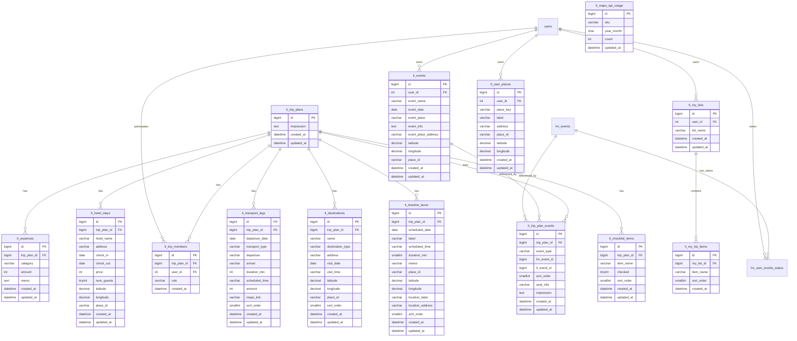

# 遠征管理（LiveTrip）DB設計・ER図

## 概要

- 中心エンティティは `lt_trip_plans`（遠征本体）
- `lt_trip_plans` に対して、イベント・費用・宿泊・移動・目的地・タイムライン・チェックリストが 1対多
- イベントは `lt_trip_plan_events` で多イベント紐付け（`hinata` と `generic` 混在可）
- ユーザー単位テンプレートは `lt_my_lists` / `lt_my_list_items`
- Maps関連補助として `lt_user_places`（自宅等）と `lt_maps_api_usage`（月次利用量）を保持

## 主要テーブル一覧（要点）

- `lt_trip_plans`: 遠征本体（`id`, `impression`, timestamps）
- `lt_trip_members`: 遠征参加者（`trip_plan_id`, `user_id`, `role`）
- `lt_trip_plan_events`: 遠征とイベントの紐付け（`event_type`, `hn_event_id`, `lt_event_id`, `seat_info`, `impression`）
- `lt_events`: 汎用イベントマスタ（ユーザー作成）
- `lt_expenses`: 費用
- `lt_hotel_stays`: 宿泊
- `lt_transport_legs`: 移動区間（`departure_date`, `scheduled_time`, `amount`, `maps_link` あり）
- `lt_destinations`: 目的地
- `lt_timeline_items`: 当日/複数日タイムライン（`scheduled_date`, `duration_min`, 位置情報あり）
- `lt_checklist_items`: 遠征ごとのチェックリスト
- `lt_my_lists` / `lt_my_list_items`: 持ち物テンプレート
- `lt_user_places`: ユーザー別地点（home等）
- `lt_maps_api_usage`: Maps API利用量（月次SKU）

## ER図（Mermaid）

## 補足

- `lt_trip_plan_events.event_type` は `hinata|generic` を想定
- `lt_trip_plan_events.hn_event_id` / `lt_trip_plan_events.lt_event_id` は排他的に利用する想定（片方のみ設定）
- `lt_maps_api_usage` は業務エンティティではなく、外部API利用量の運用管理テーブル
