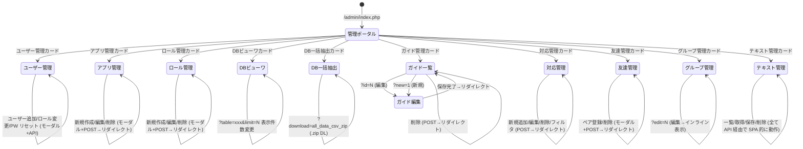
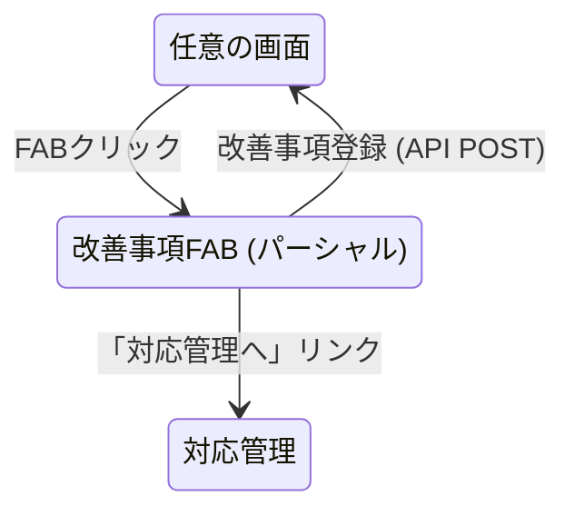

# 管理画面 (admin) 画面遷移図

## 1. 画面遷移フロー

## 2. 横断的な遷移: 改善事項 FAB

改善事項 FAB (`admin_utility_fab.php`) はすべての管理画面を含むプラットフォーム全画面に配置される。FAB から直接 API (`/admin/api/save_improvement_item.php`) を呼び出して改善事項を登録でき、「対応管理へ」リンクから対応管理画面へ遷移することもできる。

## 3. 認可による遷移制御

- すべてのエントリポイントで `Auth::requireAdmin()` を実行する。
- admin ロール以外のユーザーは 403 リダイレクトとなり、管理画面配下にはアクセスできない。
- API エンドポイント（テキスト管理、改善事項 FAB、ガイド画像）でも `$_SESSION['user']['role'] === 'admin'` を検証し、403 JSON を返す。
