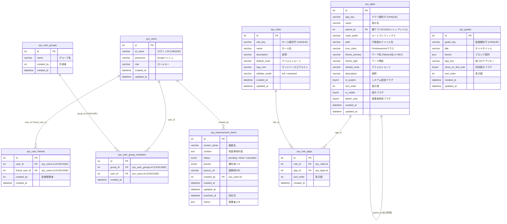
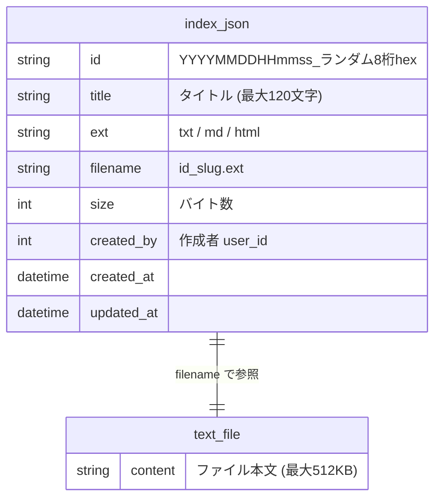

# 管理画面 (admin) ER図

## 1. データモデル関係図

## 2. テキスト管理のデータ構造（ファイルベース）

テキスト管理は DB テーブルを持たず、ファイルシステム上の `private/storage/admin_text_files/` ディレクトリで管理する。

- **メタデータ管理**: `index.json` に全エントリのメタ情報を JSON 配列で保持
- **ファイル本体**: `{id}_{slug}.{ext}` の命名規則でディレクトリ内に保存

## 3. information_schema 参照（DB ビューワ / DB 一括抽出）

DB ビューワおよび DB 一括抽出では、MySQL の `information_schema` を読み取り専用で参照する。管理画面が所有するテーブルではなく、データベース全体のメタ情報を閲覧する用途である。

- `information_schema.TABLES`: テーブル一覧取得 (`TABLE_NAME`)
- `information_schema.COLUMNS`: カラム構造取得 (`COLUMN_NAME`, `COLUMN_TYPE`, `IS_NULLABLE`, `COLUMN_KEY`, `COLUMN_DEFAULT`, `EXTRA`)
- `SHOW CREATE TABLE`: CREATE 文取得
