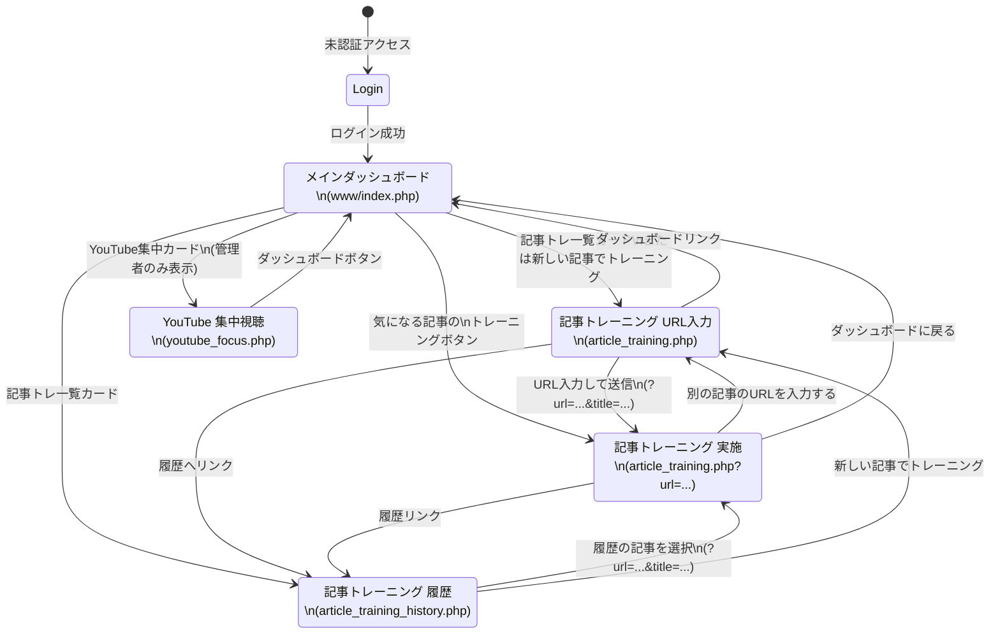

# ダッシュボード (dashboard) 画面遷移図

## 1. 画面遷移フロー

## 2. 遷移パラメータ

| 遷移元 | 遷移先 | パラメータ | 説明 |
| :--- | :--- | :--- | :--- |
| ダッシュボード（気になる記事） | 記事トレーニング実施 | `?url={記事URL}&title={記事タイトル}` | RSSフィードの記事URLとタイトルを引き継ぐ |
| 記事トレーニングURL入力 | 記事トレーニング実施 | `?url={入力URL}&title={入力タイトル}` | フォームからGETで遷移。スキーム省略時は `https://` を自動付与 |
| 記事トレーニング履歴 | 記事トレーニング実施 | `?url={article_url}&title={article_title}` | 履歴レコードのURLとタイトルを引き継ぐ |
| YouTube集中視聴 | YouTube集中視聴 | `?view=all` or `?view=grouped` | 表示モード切替（投稿日時順 / チャンネル別） |
| YouTube集中視聴 | YouTube集中視聴 | `?refresh=1` | 強制再取得フラグ |
