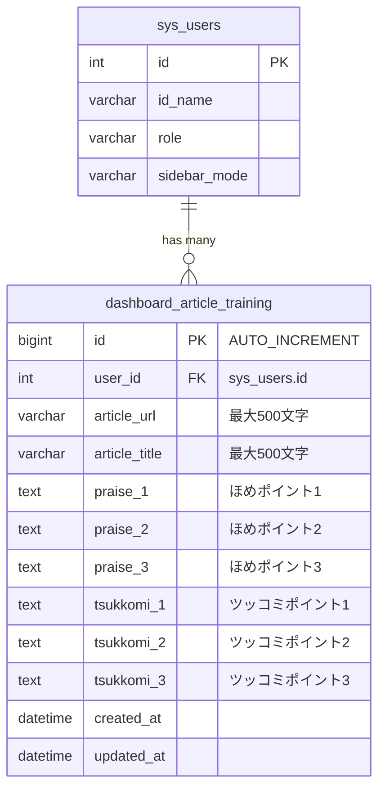

# ダッシュボード (dashboard) ER図

## 1. データモデル関係図

## 2. テーブル補足

### dashboard_article_training
- **ユニーク制約**: `uk_user_article (user_id, article_url)` -- 同一ユーザー・同一URLで1レコードとし、ON DUPLICATE KEY UPDATE で上書きする
- **インデックス**: `idx_user (user_id)` -- ユーザー別の履歴取得を高速化
- **文字セット**: `utf8mb4`, 照合順序: `utf8mb4_0900_ai_ci`
- **マイグレーション**: `migrations/done/add_dashboard_article_training.sql`

### キャッシュファイル（DBテーブル外）
ダッシュボードのRSSフィードとYouTube集中視聴はDBテーブルではなくファイルキャッシュを使用する。

| キャッシュファイル | 保存先 | TTL | 内容 |
| :--- | :--- | :--- | :--- |
| `dashboard_feed_curiosity_q{N}.json` | `private/cache/` | 1時間 | 好奇心ブーストの各テーマ別RSS取得結果 |
| `dashboard_feed_curiosity_fallback.json` | `private/cache/` | 1時間 | 好奇心ブーストのフォールバック検索結果 |
| `dashboard_feed_ai_gen.json` | `private/cache/` | 1時間 | AI関連記事のRSS取得結果 |
| `dashboard_feed_paleo.json` | `private/cache/` | 1時間 | パレオな男ブログのRSS取得結果 |
| `dashboard_curiosity_shown_{userId}.json` | `private/cache/` | 永続 | ユーザーごとの好奇心ブースト表示済みURL記録（最大24件） |
| `dashboard_youtube_focus_{hash}.json` | `private/cache/` | 30分 | YouTube集中視聴の動画一覧キャッシュ |
