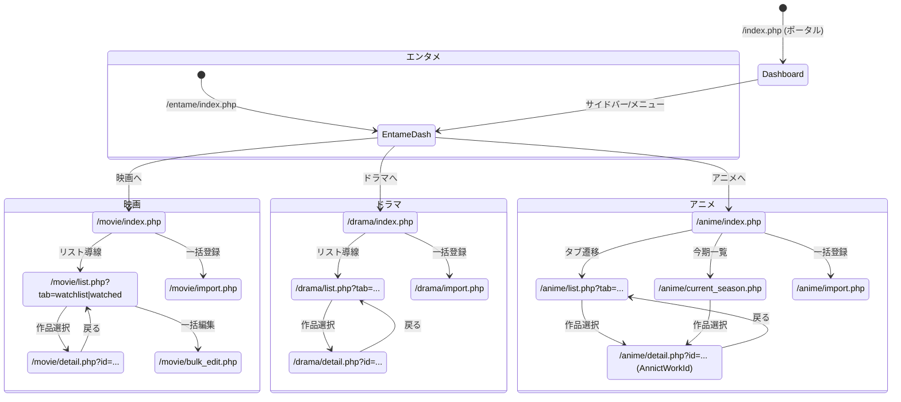

# エンタメ（アニメ・ドラマ・映画） 画面遷移図

## 1. 画面遷移フロー

```mermaid
stateDiagram-v2
    [*] --> Dashboard : /index.php (ポータル)

    state "エンタメ" as Entame {
        [*] --> EntameDash : /entame/index.php
        EntameDash --> MovieDash : 映画へ
        EntameDash --> DramaDash : ドラマへ
        EntameDash --> AnimeDash : アニメへ
    }

    state "映画" as Movie {
        MovieDash : /movie/index.php
        MovieList : /movie/list.php?tab=watchlist|watched
        MovieDetail : /movie/detail.php?id=...
        MovieImport : /movie/import.php
        MovieBulkEdit : /movie/bulk_edit.php
        MovieDash --> MovieList : リスト導線
        MovieDash --> MovieImport : 一括登録
        MovieList --> MovieDetail : 作品選択
        MovieList --> MovieBulkEdit : 一括編集
        MovieDetail --> MovieList : 戻る
    }

    state "ドラマ" as Drama {
        DramaDash : /drama/index.php
        DramaList : /drama/list.php?tab=...
        DramaDetail : /drama/detail.php?id=...
        DramaImport : /drama/import.php
        DramaDash --> DramaList : リスト導線
        DramaDash --> DramaImport : 一括登録
        DramaList --> DramaDetail : 作品選択
        DramaDetail --> DramaList : 戻る
    }

    state "アニメ" as Anime {
        AnimeDash : /anime/index.php
        AnimeList : /anime/list.php?tab=...
        AnimeDetail : /anime/detail.php?id=... (AnnictWorkId)
        AnimeSeason : /anime/current_season.php
        AnimeImport : /anime/import.php
        AnimeDash --> AnimeList : タブ遷移
        AnimeDash --> AnimeSeason : 今期一覧
        AnimeDash --> AnimeImport : 一括登録
        AnimeList --> AnimeDetail : 作品選択
        AnimeSeason --> AnimeDetail : 作品選択
        AnimeDetail --> AnimeList : 戻る
    }

    Dashboard --> EntameDash : サイドバー/メニュー
```

