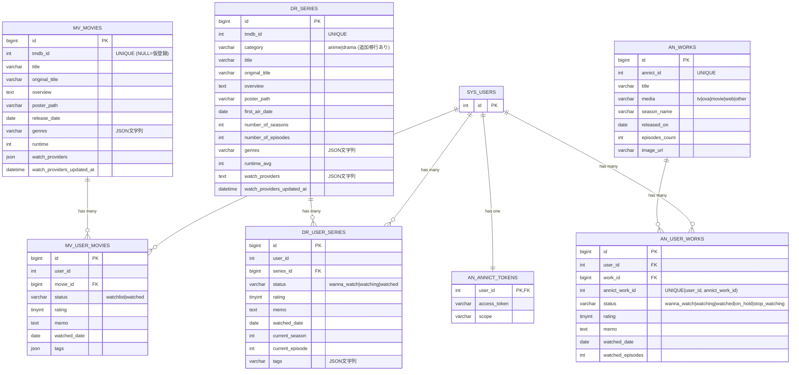

# エンタメ（アニメ・ドラマ・映画） ER図

## 1. データモデル関係図

```mermaid
erDiagram
    SYS_USERS ||--o{ MV_USER_MOVIES : "has many"
    MV_MOVIES ||--o{ MV_USER_MOVIES : "has many"

    SYS_USERS ||--o{ DR_USER_SERIES : "has many"
    DR_SERIES ||--o{ DR_USER_SERIES : "has many"

    SYS_USERS ||--o{ AN_USER_WORKS : "has many"
    AN_WORKS ||--o{ AN_USER_WORKS : "has many"
    SYS_USERS ||--|| AN_ANNICT_TOKENS : "has one"

    SYS_USERS {
        int id PK
    }

    MV_MOVIES {
        bigint id PK
        int tmdb_id "UNIQUE (NULL=仮登録)"
        varchar title
        varchar original_title
        text overview
        varchar poster_path
        date release_date
        varchar genres "JSON文字列"
        int runtime
        json watch_providers
        datetime watch_providers_updated_at
    }
    MV_USER_MOVIES {
        bigint id PK
        int user_id
        bigint movie_id FK
        varchar status "watchlist|watched"
        tinyint rating
        text memo
        date watched_date
        json tags
    }

    DR_SERIES {
        bigint id PK
        int tmdb_id "UNIQUE"
        varchar category "anime|drama (追加移行あり)"
        varchar title
        varchar original_title
        text overview
        varchar poster_path
        date first_air_date
        int number_of_seasons
        int number_of_episodes
        varchar genres "JSON文字列"
        int runtime_avg
        text watch_providers "JSON文字列"
        datetime watch_providers_updated_at
    }
    DR_USER_SERIES {
        bigint id PK
        int user_id
        bigint series_id FK
        varchar status "wanna_watch|watching|watched"
        tinyint rating
        text memo
        date watched_date
        int current_season
        int current_episode
        varchar tags "JSON文字列"
    }

    AN_ANNICT_TOKENS {
        int user_id PK, FK
        varchar access_token
        varchar scope
    }
    AN_WORKS {
        bigint id PK
        int annict_id "UNIQUE"
        varchar title
        varchar media "tv|ova|movie|web|other"
        varchar season_name
        date released_on
        int episodes_count
        varchar image_url
    }
    AN_USER_WORKS {
        bigint id PK
        int user_id FK
        bigint work_id FK
        int annict_work_id "UNIQUE(user_id, annict_work_id)"
        varchar status "wanna_watch|watching|watched|on_hold|stop_watching"
        tinyint rating
        text memo
        date watched_date
        int watched_episodes
    }
```

