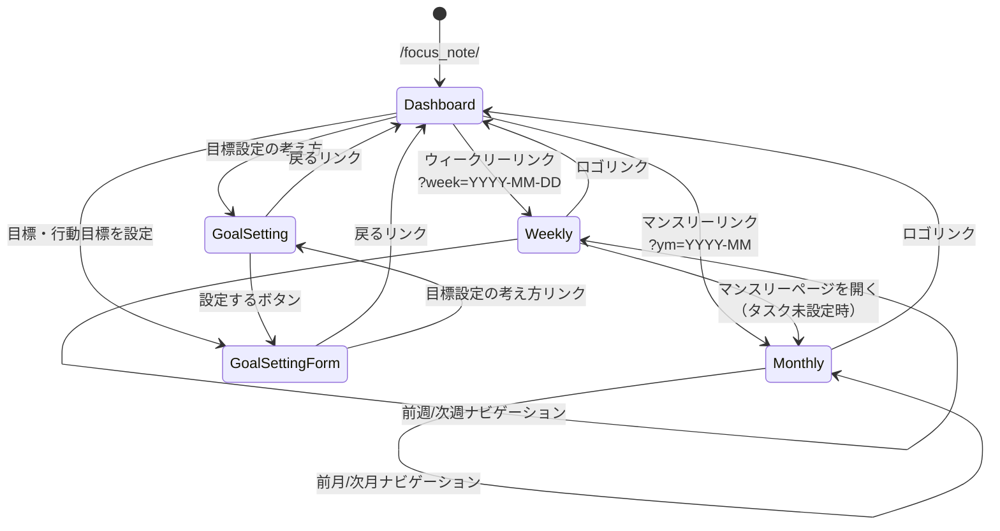
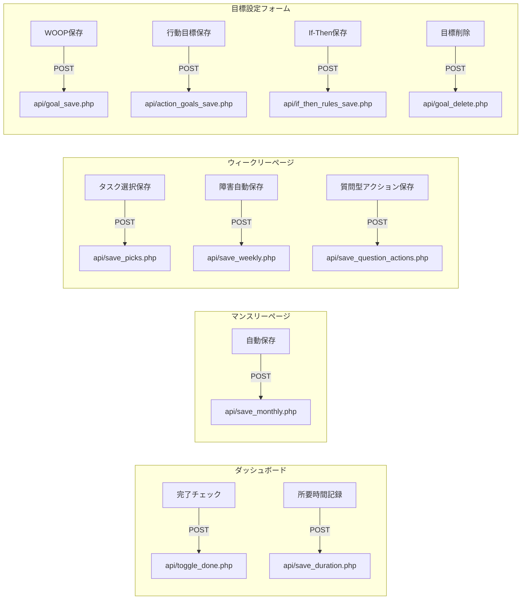

# Focus Note（フォーカスノート） 画面遷移図

## 1. 画面遷移フロー

## 2. 遷移の補足

### ダッシュボード（index.php）
- 今週の質問型アクション一覧を表示
- アクション未設定時はウィークリーページへの誘導リンクを表示
- ナビゲーションリンク: マンスリー（当月）、ウィークリー（今週）、目標設定の考え方、目標・行動目標を設定

### マンスリーページ（monthly.php）
- クエリパラメータ `?ym=YYYY-MM` で表示月を指定
- ヘッダーの左右矢印で前月・次月に遷移
- 入力はフォーカスアウト後1.5秒で自動保存（画面遷移なし）

### ウィークリーページ（weekly.php）
- クエリパラメータ `?week=YYYY-MM-DD` で表示週を指定（内部で月曜日に補正）
- ヘッダーの左右矢印で前週・次週に遷移
- タスク選択保存・質問型アクション保存後はページリロード
- デイリータスク未設定時はマンスリーページへの誘導リンクを表示

### 目標設定の考え方（goal_setting.php）
- 読み取り専用の解説ページ（MAC原則/WOOP/If-Then/プロセス目標/目標設定の落とし穴）
- 「設定する」ボタンで目標設定フォームへ遷移

### 目標・行動目標設定フォーム（goal_setting_form.php）
- WOOP保存 → 新規作成時はページリロード（goal_idを取得するため）
- 行動目標保存/If-Then保存 → トースト通知のみ（画面遷移なし）
- 目標削除 → 削除後に同ページへリダイレクト（新規入力状態になる）

## 3. API呼び出しフロー

