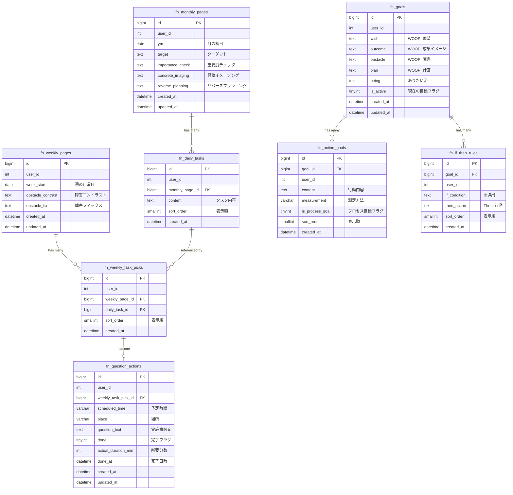

# Focus Note（フォーカスノート） ER図

## 1. データモデル関係図

## 2. テーブル関係の補足

### 報酬感覚プランニング系（マンスリー → ウィークリー → アクション）
- **fn_monthly_pages** は月ごとに1レコード。`user_id + ym` でユニーク制約。初回アクセス時に自動作成される。
- **fn_daily_tasks** はマンスリーページに紐づく複数のタスク。保存時は既存レコードを全削除してから再挿入（一括置換方式）。
- **fn_weekly_pages** は週ごとに1レコード。`user_id + week_start` でユニーク制約。月曜日を起点として自動計算される。
- **fn_weekly_task_picks** はウィークリーページから fn_daily_tasks への参照（3〜5個選択）。一括置換方式。
- **fn_question_actions** はピック1件に対して1件の実施意図（1:1）。時間・場所を設定すると「[名前]は、[時間]に[場所]で[タスク]をするか？」という質問文が自動生成される。

### 目標設定系（WOOP / MAC / If-Then）
- **fn_goals** はユーザーの目標（WOOP形式）。`is_active=1` のレコードが現在の目標。新規作成時に既存のactive目標を非活性化する。
- **fn_action_goals** は目標に紐づく行動目標（MAC原則）。`goal_id` で紐づき、CASCADE削除。一括置換方式。
- **fn_if_then_rules** は目標に紐づくIf-Thenルール。`goal_id` で紐づき、CASCADE削除。一括置換方式。

### ユーザー隔離
- 全テーブルに `user_id` カラムがあり、`BaseModel::isUserIsolated = true` により全クエリで `user_id` スコープが自動付加される。
