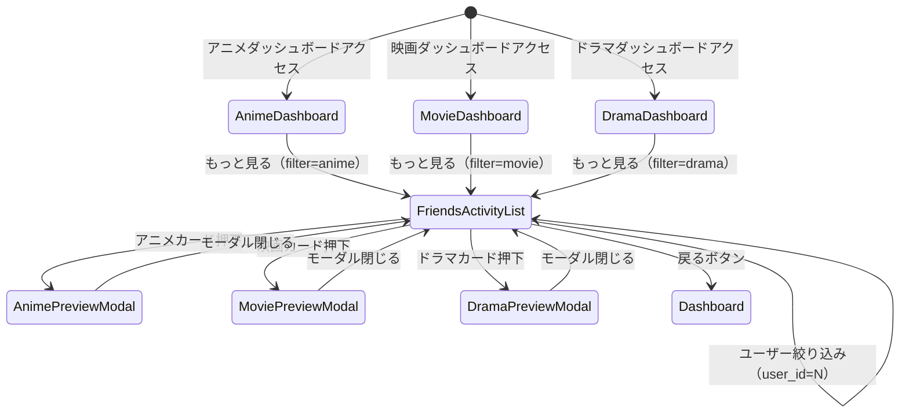
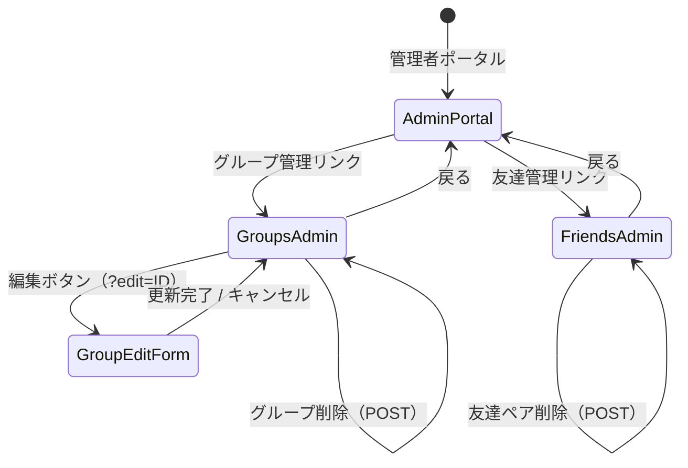

# フレンズアクティビティ (FriendsActivity) 画面遷移図

## 1. 画面遷移フロー

### 1.1 ユーザー向け画面遷移

### 1.2 管理者向け画面遷移（友達・グループ管理）

## 2. URL/パラメータ一覧

| 画面 | URL | GETパラメータ | 説明 |
| :--- | :--- | :--- | :--- |
| 友人の視聴一覧 | `/friends_activity.php` | なし | 全ジャンル・全ユーザー表示 |
| 友人の視聴一覧（種別絞り込み） | `/friends_activity.php` | `filter=anime\|movie\|drama` | 指定ジャンルのみ表示 |
| 友人の視聴一覧（ユーザー絞り込み） | `/friends_activity.php` | `user_id=N` | 指定ユーザーの視聴のみ表示 |
| 友人の視聴一覧（複合フィルタ） | `/friends_activity.php` | `filter=anime&user_id=N` | ジャンル + ユーザーの複合絞り込み |
| 友達管理（管理者） | `/admin/friends.php` | なし | 友達ペア一覧・登録・削除 |
| グループ管理（管理者） | `/admin/friend_groups.php` | なし | グループ一覧・作成・削除 |
| グループ編集（管理者） | `/admin/friend_groups.php` | `edit=ID` | グループ名・メンバー編集フォーム表示 |
