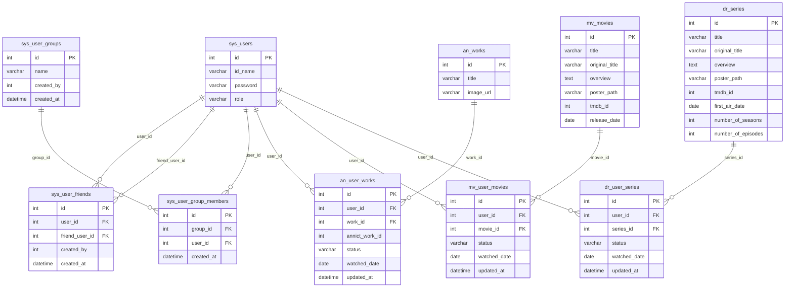

# フレンズアクティビティ (FriendsActivity) ER図

## 1. データモデル関係図

## 2. テーブル関係の説明

### 友達・グループ関連（本機能固有テーブル）
- **sys_user_friends**: 管理者が登録する1対1の相互可視関係。`user_id < friend_user_id` で正規化格納し、ユニーク制約で重複を防止する。
- **sys_user_groups**: 管理者が作成する視聴共有用グループ。削除時は CASCADE で `sys_user_group_members` も連動削除。
- **sys_user_group_members**: グループとユーザーの中間テーブル。`(group_id, user_id)` のユニーク制約で重複メンバーを防止する。

### 視聴データ参照テーブル（他機能が管理）
- **an_user_works / an_works**: アニメ機能が管理。本機能は `status = 'watched'` のレコードを参照する。
- **mv_user_movies / mv_movies**: 映画機能が管理。本機能は `status = 'watched'` のレコードを参照する。
- **dr_user_series / dr_series**: ドラマ機能が管理。本機能は `status = 'watched'` のレコードを参照する。

### 閲覧可能ユーザーの導出ロジック
1. `sys_user_friends` から `user_id` または `friend_user_id` が自分のレコードを取得し、相手側のIDを抽出する。
2. `sys_user_group_members` から自分と同一グループに属するユーザーIDを取得する。
3. 上記2つの結果をマージし、重複排除・自分を除外した結果が「閲覧可能ユーザーID一覧」となる。
