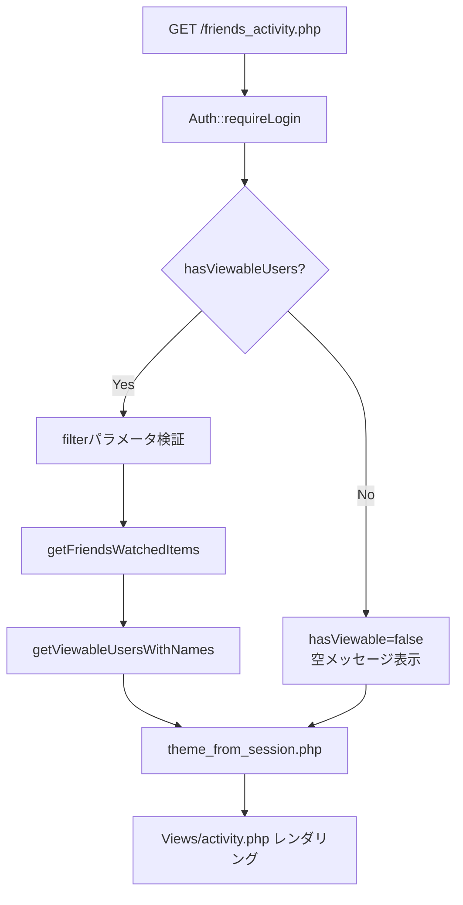
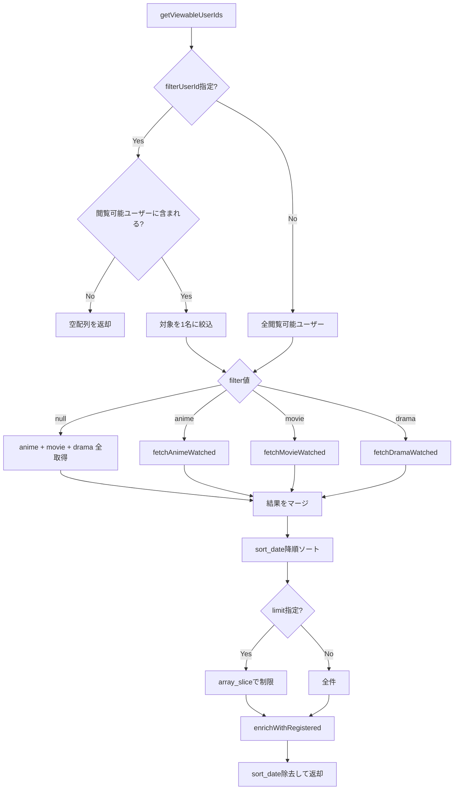

# フレンズアクティビティ (FriendsActivity) 処理詳細・I/O定義書

## 1. エンドポイント / アクション一覧

### 1.1 ユーザー向けエンドポイント

| HTTP | 公開パス (www からの相対) | Controller / 処理 | 認可 | 入力 | 出力 |
| :--- | :--- | :--- | :--- | :--- | :--- |
| GET | `friends_activity.php` | `FriendsActivityController::activity` | ログイン必須 | `?filter=anime\|movie\|drama` `&user_id=N` (いずれも任意) | HTML |

### 1.2 管理者向けエンドポイント

| HTTP | 公開パス (www からの相対) | Controller / 処理 | 認可 | 入力 | 出力 |
| :--- | :--- | :--- | :--- | :--- | :--- |
| GET | `admin/friends.php` | `AdminController::friends` | 管理者必須 | なし | HTML (友達一覧) |
| POST | `admin/friends.php` | `AdminController::friends` | 管理者必須 | `action=add_friend&user_id_a=N&user_id_b=N` | 302 → 自画面 |
| POST | `admin/friends.php` | `AdminController::friends` | 管理者必須 | `action=delete_friend&id=N` | 302 → 自画面 |
| GET | `admin/friend_groups.php` | `AdminController::friendGroups` | 管理者必須 | `?edit=ID` (任意) | HTML (グループ一覧 + 編集フォーム) |
| POST | `admin/friend_groups.php` | `AdminController::friendGroups` | 管理者必須 | `action=create_group&group_name=S&member_ids[]=N` | 302 → 自画面 |
| POST | `admin/friend_groups.php` | `AdminController::friendGroups` | 管理者必須 | `action=update_group&group_id=N&group_name=S&member_ids[]=N` | 302 → 自画面 |
| POST | `admin/friend_groups.php` | `AdminController::friendGroups` | 管理者必須 | `action=delete_group&group_id=N` | 302 → 自画面 |

### 1.3 リスト追加API (他アプリ提供、本機能から呼出)

| HTTP | 公開パス (www からの相対) | 本機能からの呼出方法 | 入力 (JSON/form) | 出力 (JSON) |
| :--- | :--- | :--- | :--- | :--- |
| POST | `anime/api/set_status.php` | `FriendsActivity.addAnime()` (JS) | `work_id=N, kind=wanna_watch\|watching\|watched` | `{"status":"success"}` or `{"status":"error","message":"..."}` |
| POST | `movie/api/add.php` | `FriendsActivity.addMovie()` (JS) | `tmdb_id=N, status=watchlist\|watched` | `{"status":"success"}` or `{"status":"error","message":"..."}` |
| POST | `drama/api/add.php` | `FriendsActivity.addDrama()` (JS) | `tmdb_id=N, status=wanna_watch\|watching\|watched` | `{"status":"success"}` or `{"status":"error","message":"..."}` |

## 2. 処理フロー詳細

### 2.1 友人視聴一覧表示 (GET /friends_activity.php)

1. **認証**: `Auth::requireLogin()` でログイン確認。未ログインの場合はログイン画面へリダイレクト。
2. **閲覧可能ユーザーチェック**:
   - `FriendsActivityService::hasViewableUsers($userId)` を呼出。
   - 閲覧可能ユーザーが0人の場合、`$hasViewable = false` のまま空表示へ進む。
3. **パラメータバリデーション**:
   - `$_GET['filter']`: `anime`, `movie`, `drama` のいずれかのみ許可。それ以外は `null` にフォールバック。
   - `$_GET['user_id']`: 正の整数のみ許可。0以下は `null` にフォールバック。
4. **データ取得**:
   - `FriendsActivityService::getFriendsWatchedItems($userId, null, $filter, $filterUserId)` を呼出。
   - `FriendsActivityService::getViewableUsersWithNames($userId)` でフィルタ用ユーザー一覧を取得。
5. **テーマ解決**: `$appKey = 'dashboard'` で `theme_from_session.php` を読み込み。
6. **レンダリング**: `Views/activity.php` を `require_once` で出力。

### 2.2 getFriendsWatchedItems 処理フロー

`FriendsActivityService::getFriendsWatchedItems(int $currentUserId, ?int $limit, ?string $filter, ?int $filterUserId)` の内部処理:

1. **閲覧可能ユーザーID取得**: `FriendGroupModel::getViewableUserIds($currentUserId)` で友達+グループメンバーのID一覧を取得。
2. **ユーザーフィルタ適用**: `$filterUserId` が指定され、かつ閲覧可能ユーザーに含まれる場合のみ、対象を1名に絞り込み。含まれない場合は空配列を返却。
3. **ジャンル別取得**: `$filter` に応じて以下のメソッドを呼び分け、結果をマージ:
   - `fetchAnimeWatched()`: `an_user_works` (status=watched) + `an_works` + `sys_users` をJOIN
   - `fetchMovieWatched()`: `mv_user_movies` (status=watched) + `mv_movies` + `sys_users` をJOIN
   - `fetchDramaWatched()`: `dr_user_series` (status=watched) + `dr_series` + `sys_users` をJOIN
4. **ソート**: `sort_date` (= `watched_date` or `updated_at`) の降順でソート。
5. **件数制限**: `$limit` 指定時は `array_slice` で先頭N件のみ抽出。
6. **登録済み判定付与**: `enrichWithRegistered()` で自分の登録状況を突合し `_registered` フラグを付与。
7. **整形**: `sort_date` フィールドを除去して返却。

### 2.3 閲覧可能ユーザーID取得 (getViewableUserIds)

`FriendGroupModel::getViewableUserIds(int $currentUserId)` の内部処理:

1. **友達ID取得** (`getFriendUserIds`):
   - SQL: `SELECT CASE WHEN user_id = :uid THEN friend_user_id ELSE user_id END AS other_id FROM sys_user_friends WHERE user_id = :uid1 OR friend_user_id = :uid2`
   - 自分が `user_id` 側の場合は `friend_user_id` を、逆の場合は `user_id` を返す。
2. **グループメンバーID取得** (`getGroupMemberUserIds`):
   - SQL: `SELECT DISTINCT gm.user_id FROM sys_user_group_members gm INNER JOIN sys_user_group_members my ON my.group_id = gm.group_id AND my.user_id = :uid WHERE gm.user_id != :uid2`
   - 自分と同一グループに属する他ユーザーを取得。
3. **マージ**: `array_unique(array_merge(...))` で重複排除し、自分のIDを除外。

### 2.4 友達ペア登録 (POST /admin/friends.php, action=add_friend)

1. **リクエスト受け取り・バリデーション**:
   - `$_POST['user_id_a']`, `$_POST['user_id_b']` を整数変換。
   - いずれかが0の場合: エラー「両方のユーザーを選択してください」
   - 同一IDの場合: エラー「同一ユーザーを選択できません」
   - `FriendGroupAdminModel::friendPairExists()` で重複チェック: エラー「このペアは既に登録済みです」
2. **ビジネスロジック・DB更新**:
   - `FriendGroupAdminModel::addFriend($userIdA, $userIdB, $createdBy)`:
     - `$userId = min($userIdA, $userIdB)`, `$friendUserId = max(...)` で正規化。
     - `INSERT IGNORE INTO sys_user_friends (user_id, friend_user_id, created_by)` を実行。
3. **レスポンス**: セッションに成功/エラーメッセージを格納し、302で `/admin/friends.php` へリダイレクト (PRGパターン)。

### 2.5 友達ペア削除 (POST /admin/friends.php, action=delete_friend)

1. **リクエスト受け取り**: `$_POST['id']` を整数変換。
2. **DB更新**: `FriendGroupAdminModel::deleteFriend($id)` で `DELETE FROM sys_user_friends WHERE id = :id` を実行。
3. **レスポンス**: セッションに成功メッセージを格納し、302でリダイレクト。

### 2.6 グループ作成 (POST /admin/friend_groups.php, action=create_group)

1. **リクエスト受け取り・バリデーション**:
   - `$_POST['group_name']` を `trim()`。空の場合はエラー。
   - `$_POST['member_ids']` を配列として取得し、`intval` でフィルタ。
2. **ビジネスロジック・DB更新**:
   - `FriendGroupAdminModel::createGroup($name, $createdBy)` で `sys_user_groups` にINSERT。
   - 成功時、返却された `$gid` を使い `setGroupMembers($gid, $memberIds)` でメンバーを一括登録。
3. **レスポンス**: 302でリダイレクト。

### 2.7 グループ編集 (POST /admin/friend_groups.php, action=update_group)

1. **リクエスト受け取り・バリデーション**:
   - `$_POST['group_id']`, `$_POST['group_name']`, `$_POST['member_ids']` を取得。
   - グループ名が空の場合はエラー。
2. **ビジネスロジック・DB更新**:
   - `FriendGroupAdminModel::updateGroupName($groupId, $name)` でグループ名を更新。
   - `FriendGroupAdminModel::setGroupMembers($groupId, $memberIds)` でメンバーを一括再設定 (既存メンバーをDELETEしてから新規INSERT、トランザクション制御)。
3. **レスポンス**: 302でリダイレクト。

### 2.8 グループ削除 (POST /admin/friend_groups.php, action=delete_group)

1. **リクエスト受け取り**: `$_POST['group_id']` を整数変換。
2. **DB更新**: `FriendGroupAdminModel::deleteGroup($id)` で `DELETE FROM sys_user_groups WHERE id = :id` を実行。`sys_user_group_members` は外部キーの `ON DELETE CASCADE` で連動削除。
3. **レスポンス**: 302でリダイレクト。

### 2.9 作品をリストに追加 (JS非同期処理)

一覧画面のカード上のボタンクリックで実行される JavaScript 処理:

1. **ボタン無効化**: `btnEl.disabled = true` でダブルクリック防止。アイコンをスピナー (`fa-spinner fa-spin`) に差し替え。
2. **API呼出**: `App.post(url, params)` で各アプリのAPIエンドポイントにPOSTリクエストを送信。
3. **成功時**:
   - カード右上の追加ボタン群を緑チェックマーク (`bg-emerald-500 fa-check`) に置換 (`outerHTML`)。
   - `App.toast()` で種別に応じたトースト通知を表示。
4. **失敗時**: ボタンを元の状態に復元し、エラートーストを表示。

## 3. I/O定義: getFriendsWatchedItems 返却値

`FriendsActivityService::getFriendsWatchedItems()` が返す配列の各要素:

### 3.1 共通フィールド

| フィールド名 | 型 | 説明 |
| :--- | :--- | :--- |
| type | string | `anime`, `movie`, `drama` のいずれか |
| title | string | 作品タイトル |
| detail_url | string | 作品詳細ページのURL |
| item_id | int | アイテムの識別ID (アニメ=annict_work_id, 映画/ドラマ=ユーザーレコードID) |
| user_id | int | 視聴したユーザーのID |
| id_name | string | 視聴したユーザーのid_name |
| watched_date | string\|null | 視聴日 (YYYY-MM-DD形式) |
| image_url | string\|null | ポスター/サムネイル画像URL |
| _registered | bool | ログインユーザーが登録済みか |

### 3.2 映画固有フィールド

| フィールド名 | 型 | 説明 |
| :--- | :--- | :--- |
| tmdb_id | int\|null | TMDB ID |
| poster_path | string\|null | TMDBポスターパス |
| overview | string\|null | 作品概要 |
| release_date | string\|null | 公開日 |
| original_title | string\|null | 原題 |
| user_status | string\|null | ログインユーザーのステータス (watchlist/watched) |
| user_movie_id | int\|null | ログインユーザーの mv_user_movies.id |

### 3.3 ドラマ固有フィールド

| フィールド名 | 型 | 説明 |
| :--- | :--- | :--- |
| tmdb_id | int\|null | TMDB ID |
| poster_path | string\|null | TMDBポスターパス |
| overview | string\|null | 作品概要 |
| first_air_date | string\|null | 初回放送日 |
| number_of_seasons | int\|null | シーズン数 |
| number_of_episodes | int\|null | エピソード数 |
| original_title | string\|null | 原題 |
| user_status | string\|null | ログインユーザーのステータス (wanna_watch/watching/watched) |
| user_series_id | int\|null | ログインユーザーの dr_user_series.id |

## 4. I/O定義: getViewableUsersWithNames 返却値

`FriendsActivityService::getViewableUsersWithNames()` が返す配列の各要素:

| フィールド名 | 型 | 説明 |
| :--- | :--- | :--- |
| user_id | int | ユーザーID |
| id_name | string | ユーザー名 (id_name) |

ソート順: `id_name` の昇順 (ASC)

## 5. エラーハンドリング方針

- **Controller層**: `try-catch(\Throwable)` で全体を囲み、例外発生時は `Core\Logger::errorWithContext()` でログ出力。画面は空データで正常表示する (画面がクラッシュしない)。
- **Service層**: 各DB問合せを `try-catch(\Throwable)` で囲み、例外時は空配列を返却。
- **Model層**: 例外はService層へ伝播させる (Model自体ではキャッチしない)。
- **管理画面**: POST処理の結果はセッション変数 (`$_SESSION['admin_success']` / `$_SESSION['admin_error']`) に格納し、PRGパターンでリダイレクト後に表示。
- **JS API呼出**: `try-catch` でネットワークエラーをキャッチし、`App.toast('エラー')` でユーザーに通知。ボタンを元の状態に復元。
