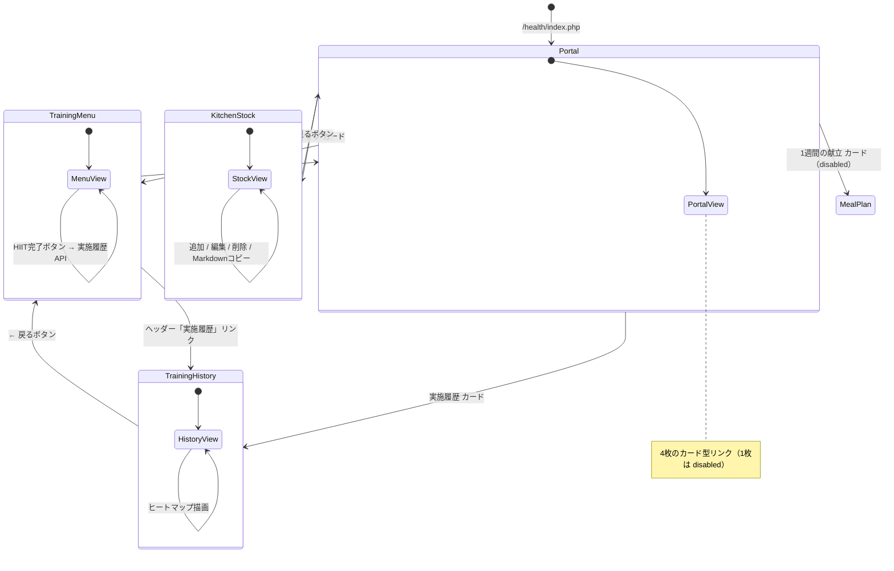

# Health（ヘルスケア/健康管理） 画面遷移図

## 1. 画面遷移フロー

## 2. 画面 - エントリポイント対応

| 画面名 | URL パス | エントリ PHP | View |
| :--- | :--- | :--- | :--- |
| Healthポータル | `/health/` | `www/health/index.php` | `private/apps/Health/Views/portal.php` |
| 食材ストック | `/health/kitchen_stock.php` | `www/health/kitchen_stock.php` | `private/apps/Health/Views/kitchen_stock.php` |
| トレーニングメニュー | `/health/training_menu.php` | `www/health/training_menu.php` | `private/apps/Health/Views/training_menu.php` |
| トレーニング実施履歴 | `/health/training_history.php` | `www/health/training_history.php` | `private/apps/Health/Views/training_history.php` |

## 3. API エンドポイント（画面内 fetch 呼び出し）

すべて POST（JSON body）。レスポンスは `application/json`。

| API パス | 呼び出し元画面 | 目的 |
| :--- | :--- | :--- |
| `/health/api/list.php` | 食材ストック | 全食材取得 |
| `/health/api/create.php` | 食材ストック | 食材追加 |
| `/health/api/update.php` | 食材ストック | 食材パッチ更新 |
| `/health/api/delete.php` | 食材ストック | 食材削除 |
| `/health/api/training_list.php` | トレーニングメニュー | 全メニュー取得 |
| `/health/api/training_create.php` | トレーニングメニュー | メニュー追加 |
| `/health/api/training_update.php` | トレーニングメニュー | メニューパッチ更新 |
| `/health/api/training_delete.php` | トレーニングメニュー | メニュー削除 |
| `/health/api/training_log_list.php` | トレーニング実施履歴 | 履歴一覧取得（期間指定） |
| `/health/api/training_log_create.php` | （個別記録用） | 個別メニュー実施記録 |
| `/health/api/training_log_create_hiit.php` | トレーニングメニュー / 実施履歴 | HIIT一括記録 |
| `/health/api/training_log_delete.php` | トレーニング実施履歴 | 履歴削除 |
