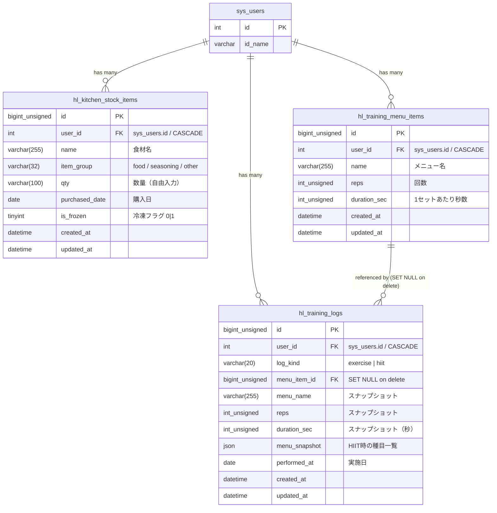

# Health（ヘルスケア/健康管理） ER図

## 1. データモデル関係図

## 2. インデックス一覧

| テーブル | インデックス名 | カラム | 備考 |
| :--- | :--- | :--- | :--- |
| `hl_kitchen_stock_items` | PRIMARY | `id` | |
| `hl_kitchen_stock_items` | `idx_user_purchased_date` | `user_id, purchased_date` | 一覧取得用 |
| `hl_kitchen_stock_items` | `idx_user_created_at` | `user_id, created_at` | |
| `hl_kitchen_stock_items` | `idx_user_group_purchased_date` | `user_id, item_group, purchased_date` | グループフィルタ用 |
| `hl_training_menu_items` | PRIMARY | `id` | |
| `hl_training_menu_items` | `idx_user_id` | `user_id` | |
| `hl_training_menu_items` | `idx_user_created_at` | `user_id, created_at` | |
| `hl_training_logs` | PRIMARY | `id` | |
| `hl_training_logs` | `idx_user_performed_at` | `user_id, performed_at` | 期間検索用 |
| `hl_training_logs` | `idx_user_menu_item` | `user_id, menu_item_id` | |

## 3. 外部キー制約

| テーブル | 制約名 | 参照先 | ON DELETE |
| :--- | :--- | :--- | :--- |
| `hl_kitchen_stock_items` | `fk_hl_kitchen_stock_items_user` | `sys_users(id)` | CASCADE |
| `hl_training_menu_items` | `fk_hl_training_menu_items_user` | `sys_users(id)` | CASCADE |
| `hl_training_logs` | `fk_hl_training_logs_user` | `sys_users(id)` | CASCADE |
| `hl_training_logs` | `fk_hl_training_logs_menu` | `hl_training_menu_items(id)` | SET NULL |

## 4. マイグレーション適用順

| ファイル名 | 内容 |
| :--- | :--- |
| `create_hl_kitchen_stock_items.sql` | `hl_kitchen_stock_items` テーブル作成 |
| `add_health_to_sys_apps.sql` | `sys_apps` に health / health_kitchen_stock を登録 |
| `add_hl_kitchen_stock_items_item_group.sql` | `item_group` カラム追加 |
| `create_hl_training_menu_items_and_sys_app.sql` | `hl_training_menu_items` テーブル作成 + sys_apps 登録 |
| `add_hl_training_menu_items_duration_sec.sql` | `duration_sec` カラム追加 |
| `create_hl_training_logs_and_sys_app.sql` | `hl_training_logs` テーブル作成 + sys_apps 登録 |
| `add_hl_training_logs_hiit_session.sql` | `log_kind`, `menu_snapshot` カラム追加 |
