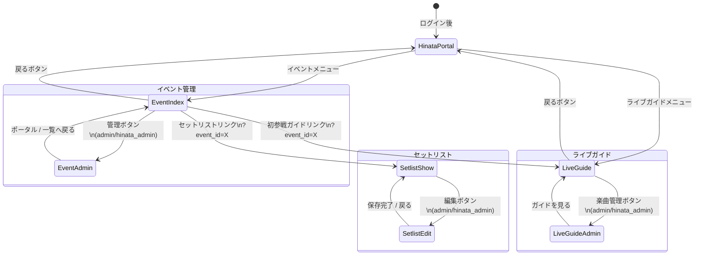
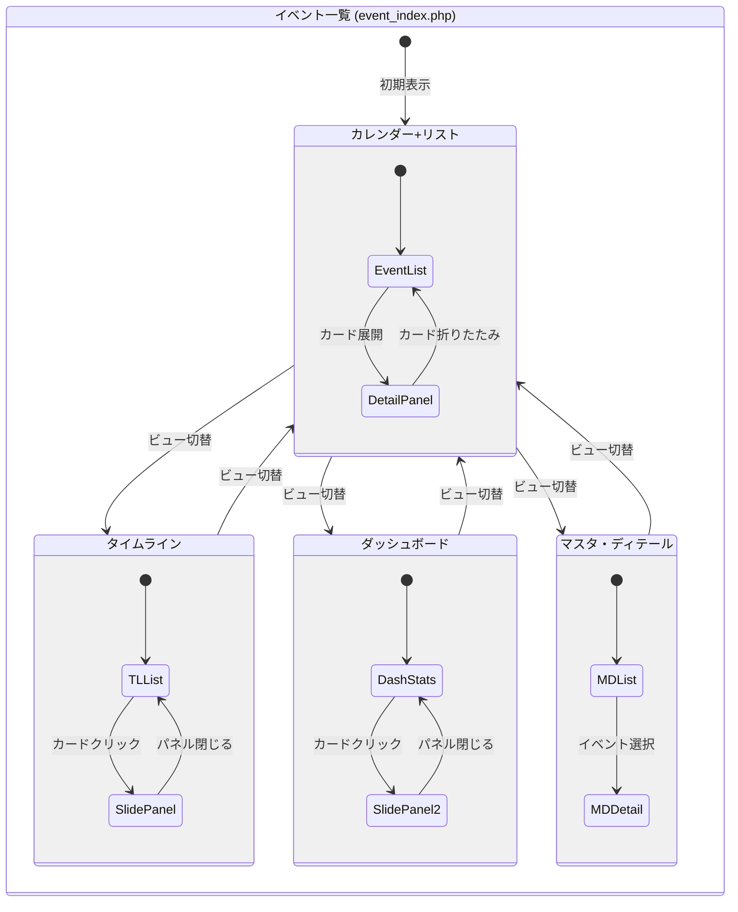
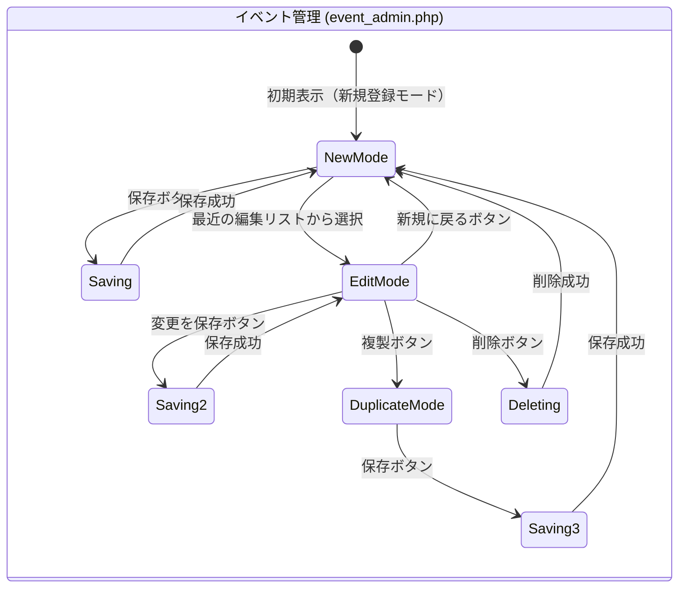
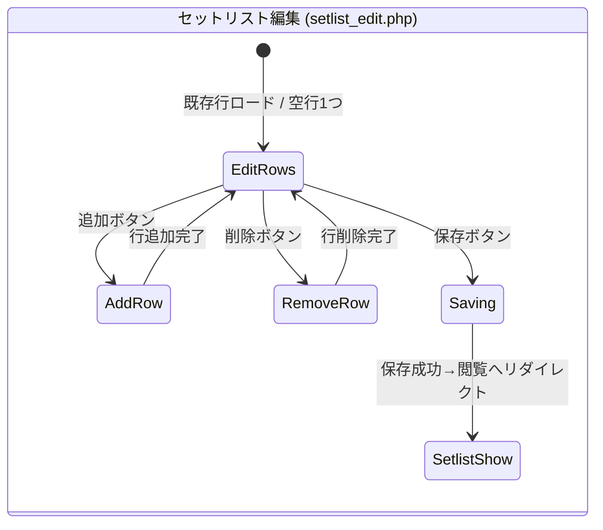
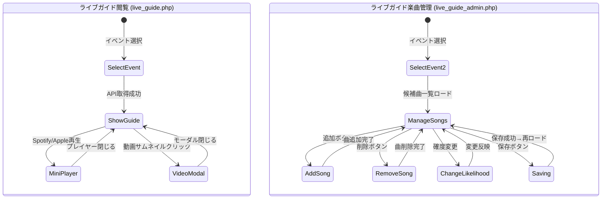

# イベント管理・セットリスト・ライブガイド (event) 画面遷移図

## 1. 全体画面遷移フロー

```mermaid
stateDiagram-v2
    [*] --> HinataPortal : ログイン後

    HinataPortal --> EventIndex : イベントメニュー
    HinataPortal --> LiveGuide : ライブガイドメニュー

    state "イベント管理" as EventGroup {
        EventIndex --> EventAdmin : 管理ボタン\n(admin/hinata_admin)
        EventAdmin --> EventIndex : ポータル / 一覧へ戻る

        EventIndex --> SetlistShow : セットリストリンク\n?event_id=X
        EventIndex --> LiveGuide : 初参戦ガイドリンク\n?event_id=X
    }

    state "セットリスト" as SetlistGroup {
        SetlistShow --> SetlistEdit : 編集ボタン\n(admin/hinata_admin)
        SetlistEdit --> SetlistShow : 保存完了 / 戻る
    }

    state "ライブガイド" as GuideGroup {
        LiveGuide --> LiveGuideAdmin : 楽曲管理ボタン\n(admin/hinata_admin)
        LiveGuideAdmin --> LiveGuide : ガイドを見る
    }

    EventIndex --> HinataPortal : 戻るボタン
    LiveGuide --> HinataPortal : 戻るボタン
```

## 2. イベント一覧画面 内部遷移（4ビューモード）

```mermaid
stateDiagram-v2
    state "イベント一覧 (event_index.php)" as EI {
        [*] --> CalendarView : 初期表示
        CalendarView --> TimelineView : ビュー切替
        CalendarView --> DashboardView : ビュー切替
        CalendarView --> MasterDetailView : ビュー切替
        TimelineView --> CalendarView : ビュー切替
        DashboardView --> CalendarView : ビュー切替
        MasterDetailView --> CalendarView : ビュー切替

        state "カレンダー+リスト" as CalendarView {
            [*] --> EventList
            EventList --> DetailPanel : カード展開
            DetailPanel --> EventList : カード折りたたみ
        }

        state "タイムライン" as TimelineView {
            [*] --> TLList
            TLList --> SlidePanel : カードクリック
            SlidePanel --> TLList : パネル閉じる
        }

        state "ダッシュボード" as DashboardView {
            [*] --> DashStats
            DashStats --> SlidePanel2 : カードクリック
            SlidePanel2 --> DashStats : パネル閉じる
        }

        state "マスタ・ディテール" as MasterDetailView {
            [*] --> MDList
            MDList --> MDDetail : イベント選択
        }
    }
```

## 3. イベント管理画面 操作フロー

```mermaid
stateDiagram-v2
    state "イベント管理 (event_admin.php)" as EA {
        [*] --> NewMode : 初期表示（新規登録モード）
        NewMode --> Saving : 保存ボタン
        Saving --> NewMode : 保存成功

        NewMode --> EditMode : 最近の編集リストから選択
        EditMode --> Saving2 : 変更を保存ボタン
        Saving2 --> EditMode : 保存成功

        EditMode --> DuplicateMode : 複製ボタン
        DuplicateMode --> Saving3 : 保存ボタン
        Saving3 --> NewMode : 保存成功

        EditMode --> Deleting : 削除ボタン
        Deleting --> NewMode : 削除成功

        EditMode --> NewMode : 新規に戻るボタン
    }
```

## 4. セットリスト編集フロー

```mermaid
stateDiagram-v2
    state "セットリスト編集 (setlist_edit.php)" as SE {
        [*] --> EditRows : 既存行ロード / 空行1つ
        EditRows --> AddRow : 追加ボタン
        AddRow --> EditRows : 行追加完了
        EditRows --> RemoveRow : 削除ボタン
        RemoveRow --> EditRows : 行削除完了
        EditRows --> Saving : 保存ボタン
        Saving --> SetlistShow : 保存成功→閲覧へリダイレクト
    }
```

## 5. ライブガイド操作フロー

```mermaid
stateDiagram-v2
    state "ライブガイド閲覧 (live_guide.php)" as LG {
        [*] --> SelectEvent : イベント選択
        SelectEvent --> ShowGuide : API取得成功
        ShowGuide --> MiniPlayer : Spotify/Apple再生
        MiniPlayer --> ShowGuide : プレイヤー閉じる
        ShowGuide --> VideoModal : 動画サムネイルクリック
        VideoModal --> ShowGuide : モーダル閉じる
    }

    state "ライブガイド楽曲管理 (live_guide_admin.php)" as LGA {
        [*] --> SelectEvent2 : イベント選択
        SelectEvent2 --> ManageSongs : 候補曲一覧ロード
        ManageSongs --> AddSong : 追加ボタン
        AddSong --> ManageSongs : 曲追加完了
        ManageSongs --> RemoveSong : 削除ボタン
        RemoveSong --> ManageSongs : 曲削除完了
        ManageSongs --> ChangeLikelihood : 確度変更
        ChangeLikelihood --> ManageSongs : 変更反映
        ManageSongs --> Saving : 保存ボタン
        Saving --> ManageSongs : 保存成功→再ロード
    }
```
