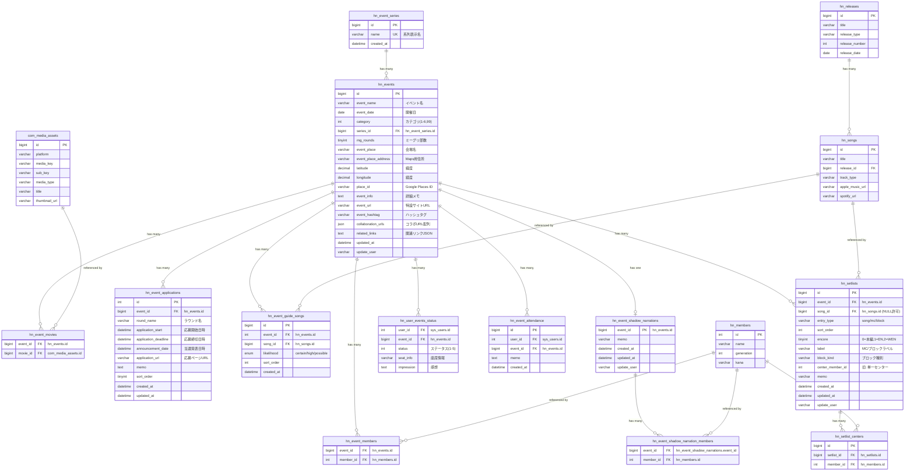

# イベント管理・セットリスト・ライブガイド (event) ER図

## 1. データモデル関係図

## 2. テーブル間の補足事項

- `hn_events` と `hn_event_series` は N:1 の関係。`series_id` が NULL の場合は系列未設定。
- `hn_event_members` は複合主キーではなく、`(event_id, member_id)` の組で管理（イベント保存時に全件 delete-insert）。
- `hn_event_movies` は `com_media_assets` を参照する FK を持つ（`ON DELETE CASCADE`）。`EventRelatedLinkService::syncYoutubeMovie()` で自動同期。
- `hn_user_events_status` は `(user_id, event_id)` の UNIQUE KEY で upsert（`ON DUPLICATE KEY UPDATE`）。
- `hn_event_attendance` は `(user_id, event_id)` の UNIQUE KEY でトグル（存在すれば DELETE、なければ INSERT）。
- `hn_setlists` の `center_member_id` はレガシーカラムで、`hn_setlist_centers` が正。互換ロジックで両方を保持。
- `hn_event_shadow_narrations` は `event_id` が PK（イベントに1件のみ）。メンバーは `hn_event_shadow_narration_members` で複数管理。
- `hn_event_guide_songs` は `(event_id, song_id)` の UNIQUE KEY で重複登録を防止。`hn_songs` への FK あり（`ON DELETE CASCADE`）。
