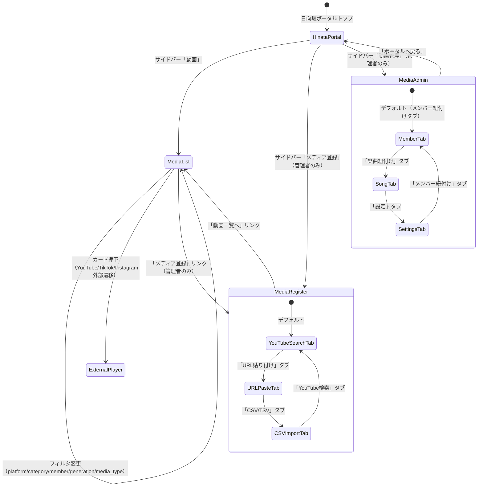
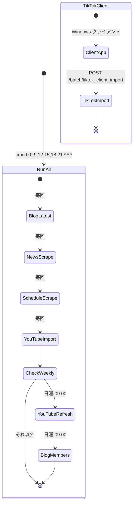

# Media（メディア管理） 画面遷移図

## 1. 画面遷移フロー

## 2. バッチジョブフロー

## 3. 遷移パラメータ

| 遷移元 | 遷移先 | パラメータ | 説明 |
| :--- | :--- | :--- | :--- |
| 動画一覧 | 動画一覧（追加ロード） | `?offset=&limit=25&category=&sort=newest&platform=&member_id=&generation=&media_type=` | 無限スクロール用。offset をインクリメント |
| ポータルトップ | メディア登録 | なし | 管理者ロールのみアクセス可 |
| ポータルトップ | 動画管理（統合） | `media_member_admin.php` / `media_song_admin.php` / `media_settings_admin.php` | 初期タブが member / song / settings に分岐 |
| 動画管理 | 紐付け管理用動画一覧 | `?q=&category=&platform=&media_type=&unlinked_only=&link_type=song&limit=100` | 動画管理画面内の動画検索 |
| バッチ統合ランナー | ブログスクレイプ | `[pages] [mode]`（CLI 引数） | mode: latest / members |
| バッチ統合ランナー | ニューススクレイプ | `[months]`（CLI 引数） | 対象月数（当月+翌月） |
| バッチ統合ランナー | スケジュールスクレイプ | `[months]`（CLI 引数） | 対象月数（当月+翌月） |
| バッチ統合ランナー | YouTube リフレッシュ | `[limit]`（CLI 引数） | 処理件数上限 |
| 外部クライアント | TikTok インポート | `POST { token, account, urls[], category }` | ヘッダ or ボディでトークン認証 |
