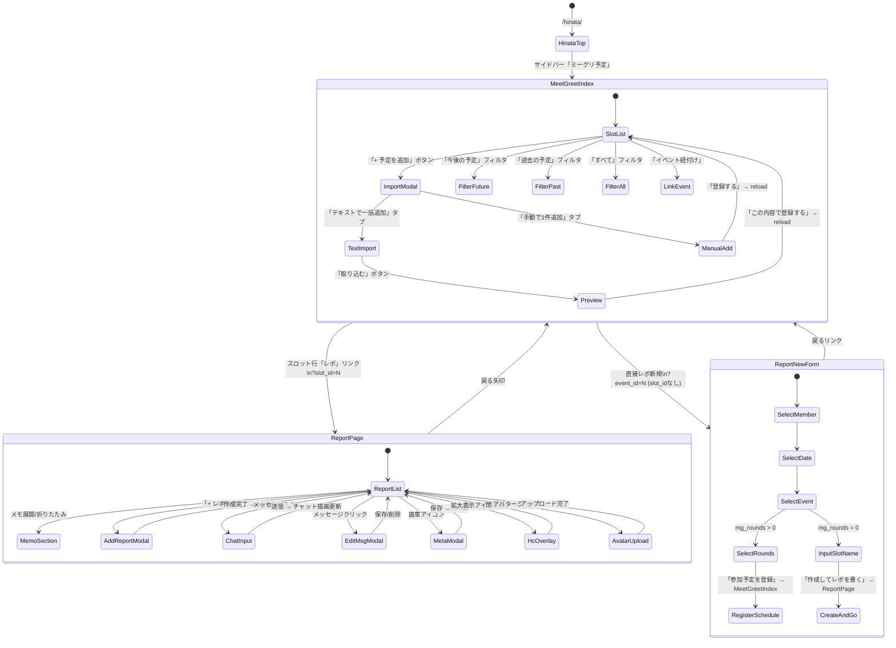
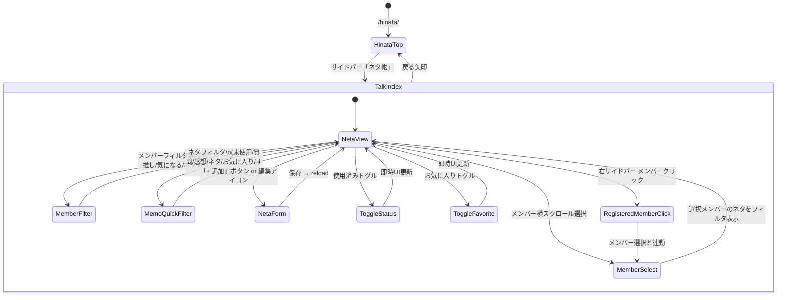

# ミーグリ（お話し会）& ネタ帳 画面遷移図

## 1. ミーグリ予定・レポ 画面遷移フロー

## 2. ネタ帳 画面遷移フロー

## 3. 画面間の遷移パラメータ

| 遷移元 | 遷移先 | パラメータ | 説明 |
| :--- | :--- | :--- | :--- |
| ミーグリ予定一覧 | レポページ | `?slot_id={id}` | スロットIDを指定してレポを表示 |
| ミーグリ予定一覧 | レポ新規作成 | `?event_id={id}` | イベントIDを指定して新規作成フォームを表示 |
| レポ新規作成 | レポページ | `?slot_id={id}` | スロット作成後にレポページへリダイレクト |
| レポ新規作成 | ミーグリ予定一覧 | (なし) | 参加予定登録後にリダイレクト |
| ダッシュボード等 | ミーグリ予定一覧 | `?focus_slot_id={id}` | 特定スロットにフォーカスしてスクロール |
| ダッシュボード等 | ミーグリ予定一覧 | `?focus_event_date={date}` | 特定日付のアコーディオンを展開 |
