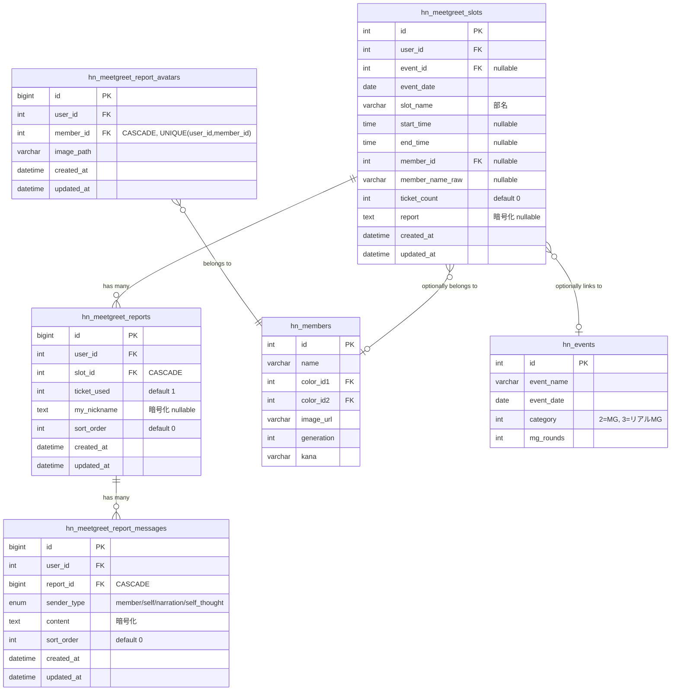
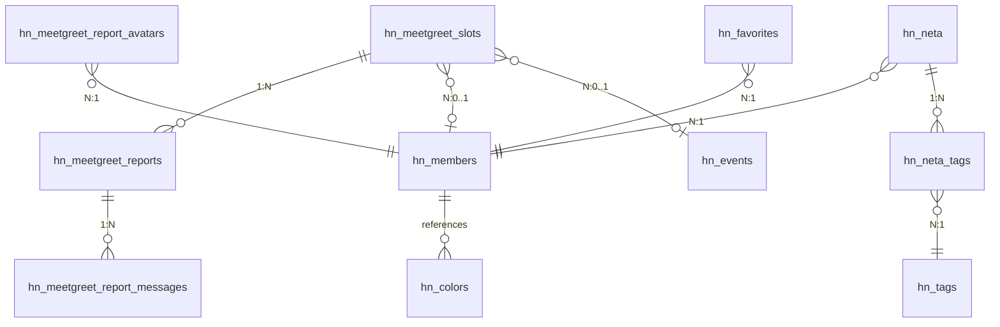

# ミーグリ（お話し会）& ネタ帳 ER図

## 1. ミーグリ データモデル関係図



## 2. ネタ帳 データモデル関係図

```mermaid
erDiagram
    hn_neta ||--o{ hn_neta_tags : "has many"
    hn_neta_tags }o--|| hn_tags : "references"
    hn_neta }o--|| hn_members : "belongs to"

    hn_neta {
        bigint id PK
        int user_id FK
        int member_id FK
        text content "暗号化"
        text memo "暗号化 nullable"
        varchar neta_type "nullable: question/impression/joke"
        tinyint is_favorite "default 0"
        varchar status "stock/done/delete"
        datetime created_at
        datetime updated_at
    }

    hn_tags {
        int id PK
        int user_id FK
        varchar name "UNIQUE(user_id,name)"
        datetime created_at
        datetime updated_at
    }

    hn_neta_tags {
        bigint neta_id PK_FK "CASCADE"
        int tag_id PK_FK "CASCADE"
        datetime created_at
    }
```

## 3. 全体関係概要図



## 4. カスケード削除チェーン

| 親テーブル | 子テーブル | 動作 |
| :--- | :--- | :--- |
| hn_meetgreet_slots | hn_meetgreet_reports | ON DELETE CASCADE |
| hn_meetgreet_reports | hn_meetgreet_report_messages | ON DELETE CASCADE |
| hn_members | hn_meetgreet_report_avatars | ON DELETE CASCADE |
| hn_neta | hn_neta_tags | ON DELETE CASCADE |
| hn_tags | hn_neta_tags | ON DELETE CASCADE |
