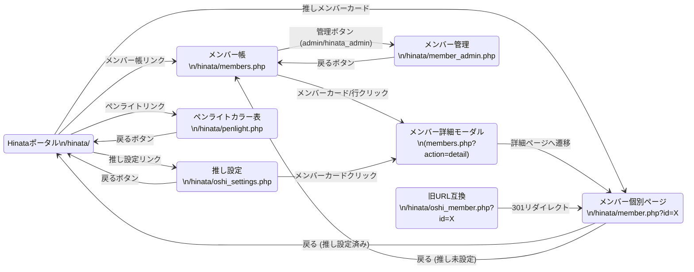
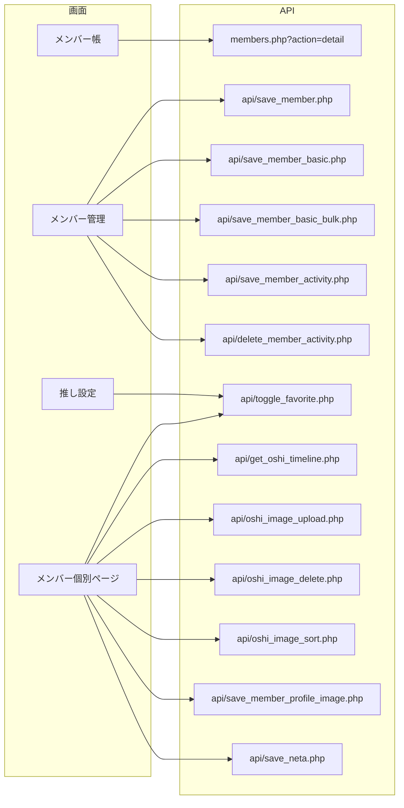

# メンバー (Member) 画面遷移図

## 1. 画面遷移フロー

## 2. API 呼び出しフロー

## 3. 遷移条件の補足

| 遷移 | 条件 |
| :--- | :--- |
| メンバー帳 → メンバー管理 | ユーザーロールが `admin` または `hinata_admin` の場合のみ管理ボタン表示 |
| メンバー個別ページ → 戻り先 | 推しレベル > 0 の場合は `/hinata/` へ、それ以外は `/hinata/members.php` へ |
| ペンライト → 戻り先 | `?from=live_guide&event_id=X` パラメータがある場合はライブガイドへ、それ以外はポータルへ |
| 旧URL互換 | `/hinata/oshi_member.php?id=X` は `/hinata/member.php?id=X` へ 301 リダイレクト |
| メンバー管理のクエリ指定 | `?member_id=X` で直接メンバーを選択状態にして表示 |
