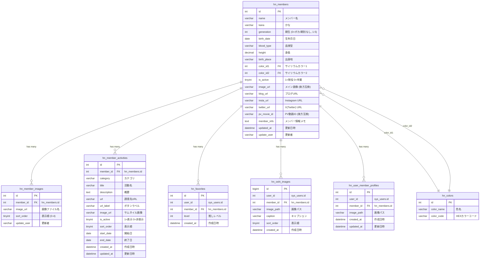
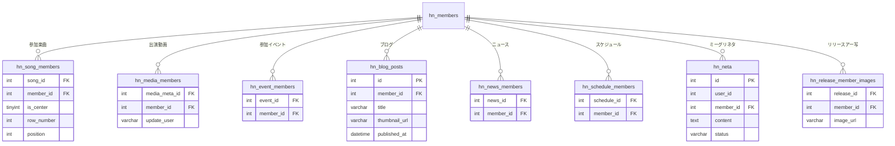

# メンバー (Member) ER図

## 1. データモデル関係図

## 2. 参照テーブル関係図（他ドメインとの接点）

## 3. テーブル間の関係補足

| 関係 | 説明 |
| :--- | :--- |
| `hn_members` → `hn_colors` | color_id1, color_id2 で 2 色を参照。LEFT JOIN のため NULL 許容 |
| `hn_members` → `hn_member_images` | 1メンバーあたり最大5枚。CASCADE DELETE |
| `hn_members` → `hn_member_activities` | 1メンバーに対して複数の個人活動。CASCADE DELETE |
| `hn_members` → `hn_favorites` | ユーザーごとに1レコード。level 7-9 はユーザーあたり各1名の排他制約 |
| `hn_members` → `hn_oshi_images` | ユーザー+メンバーの組み合わせごとに最大10枚 |
| `hn_members` → `hn_user_member_profiles` | ユーザー+メンバーで UNIQUE。推し画像のカスタムプロフィール |
| `hn_members` → 他ドメインテーブル | 楽曲・動画・イベント・ブログ等は member ドメインからは参照 (READ) のみ |
