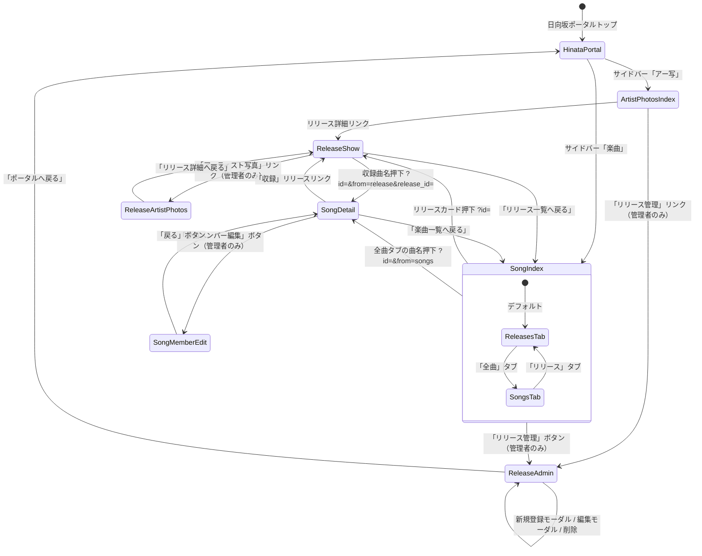

# Music（楽曲・リリース・アーティスト写真） 画面遷移図

## 1. 画面遷移フロー

## 2. 遷移パラメータ

| 遷移元 | 遷移先 | パラメータ | 説明 |
| :--- | :--- | :--- | :--- |
| 楽曲トップ | リリース詳細 | `?id={release_id}` | リリースID |
| 楽曲トップ (全曲タブ) | 楽曲詳細 | `?id={song_id}&from=songs` | 戻り先判定用 |
| リリース詳細 | 楽曲詳細 | `?id={song_id}&from=release&release_id={release_id}` | 戻り先をリリース詳細に設定 |
| 楽曲詳細 | メンバー編集 | `?song_id={song_id}` | 編集対象の楽曲ID |
| リリース詳細 | アー写登録 | `?release_id={release_id}` | 対象リリースID |
| 楽曲トップ | 楽曲トップ | `?group={group_name}` | グループフィルタ（hinatazaka46 / hiragana_keyaki） |
| 楽曲トップ | 楽曲トップ | `?tab=songs&release_id={id}` | 特定リリースの曲だけ表示 |
| アー写一覧 | アー写一覧 | `?tab=releases` / `?tab=members` | 表示モード切替 |
| アー写一覧 | アー写一覧 | `?tab=members&member_id={id}` | 特定メンバーへスクロール |
