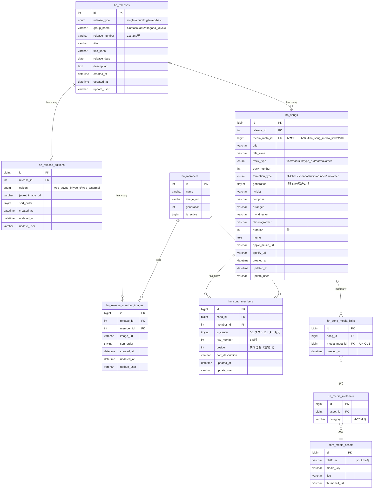

# Music（楽曲・リリース・アーティスト写真） ER図

## 1. データモデル関係図

## 2. 補足
- `hn_songs.media_meta_id` はレガシーカラムであり、現在の動画紐付けは `hn_song_media_links` 中間テーブルで管理する。既存データ移行済み。
- `hn_releases` → `hn_songs` は ON DELETE CASCADE。リリース削除時に収録曲も連鎖削除される。
- `hn_song_members` の UNIQUE KEY は `(song_id, member_id)` で同一楽曲への同一メンバー重複登録を防止。
- `hn_release_editions` の UNIQUE KEY は `(release_id, edition)` で同一リリースに同一版の重複を防止。
- `hn_release_member_images` の UNIQUE KEY は `(release_id, member_id)` で同一リリースに同一メンバーの写真は1枚のみ。
