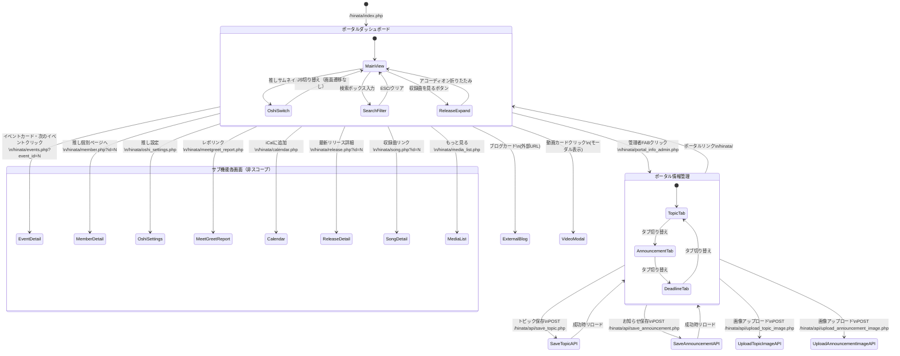

# ポータル（Portal） 画面遷移図

## 1. 画面遷移フロー

## 2. アプリカードからの遷移先一覧
ポータルダッシュボードの「アプリ」セクションから以下の画面へ遷移する。

| アプリカード | 遷移先 |
| :--- | :--- |
| ミーグリネタ帳 | /hinata/talk.php |
| ミーグリ予定 | /hinata/meetgreet.php |
| レポ登録 | /hinata/meetgreet_report.php |
| イベント | /hinata/events.php |
| メンバー帳 | /hinata/members.php |
| 楽曲 | /hinata/songs.php |
| アー写 | /hinata/artist_photos.php |
| 動画一覧 | /hinata/media_list.php |

## 3. 管理者限定ツール（管理ツールdetails内）
| ツール | 遷移先 |
| :--- | :--- |
| リリース管理 | /hinata/release_admin.php |
| ポータル情報管理 | /hinata/portal_info_admin.php |
| 動画・メンバー紐付け | /hinata/media_member_admin.php |
| 動画・楽曲紐付け | /hinata/media_song_admin.php |
| 動画設定 | /hinata/media_settings_admin.php |
| メディア登録 | /hinata/media_register.php |
