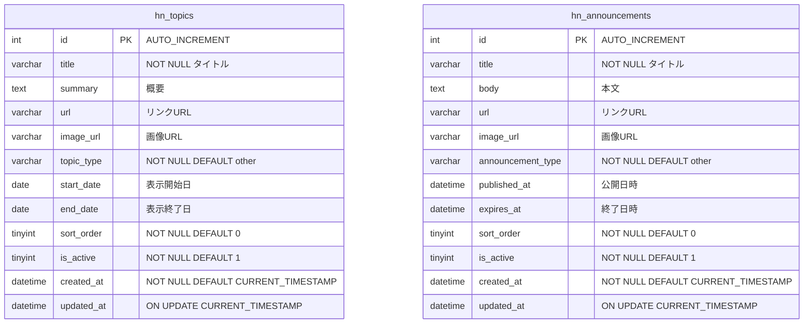
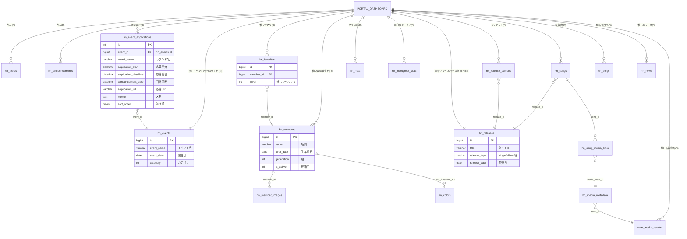

# ポータル（Portal） ER図

## 1. ポータル所有テーブルのデータモデル関係図

## 2. ポータルダッシュボードが参照する外部テーブルとの関係図

## 3. ポータル情報管理のCRUD範囲

ポータル情報管理画面（`PortalInfoController::admin`）は以下のテーブルに対してCRUD操作を行う。

| テーブル | C (作成) | R (参照) | U (更新) | D (削除) |
| :--- | :--- | :--- | :--- | :--- |
| hn_topics | save_topic API | admin画面 / ポータル | save_topic API | - |
| hn_announcements | save_announcement API | admin画面 / ポータル | save_announcement API | - |
| hn_event_applications | save_event_applications API | admin画面 / ポータル | save_event_applications API | - |
