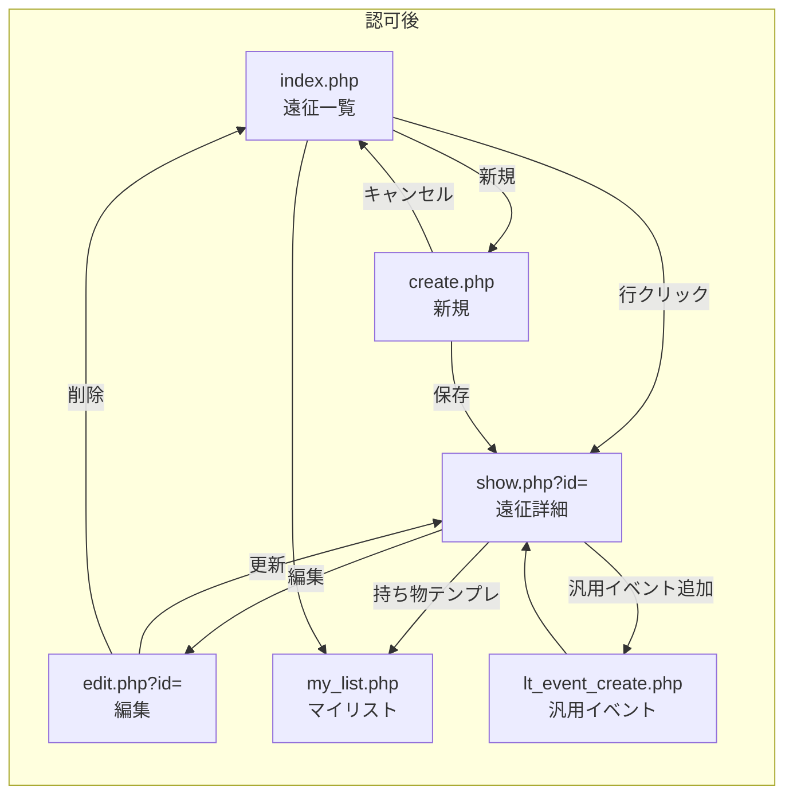

# live_trip 画面遷移図

## 1. 画面遷移フロー

注:

- 費用・宿泊等の **部分更新** は詳細画面内 POST → リダイレクトで `show.php` に戻る典型形。詳細は [23](../20_詳細設計/23_live_trip_処理詳細_I-O定義書.md)。
- **しおり**（`shiori.php`）は印刷向けの別画面。一覧・詳細からの遷移矢印は設けず、`?id=` を付けて直接アクセスする想定。
