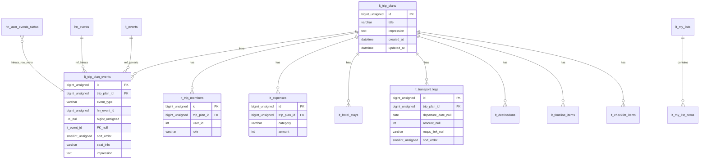

# live_trip ER図

## 1. データモデル関係図

中心は `lt_trip_plans`。イベント紐付けは **多対多に相当する中間** `lt_trip_plan_events`（`hn_events` または `lt_events` 参照）。

## 2. スキーマ差分の読み方

初期作成は `migrations/done/create_lt_livetrip_tables.sql`。以後 `add_lt_*` で列追加・イベント正規化（`lt_trip_plan_events`）等。**カラムの最終状態はモデル `$fields`** と DDL を両方確認する。

補助テーブル（共通化済み）:

- `com_user_places`: ユーザー別地点（自宅など）
- `com_maps_api_usage`: Google Maps API 利用量（月次・SKU別）
