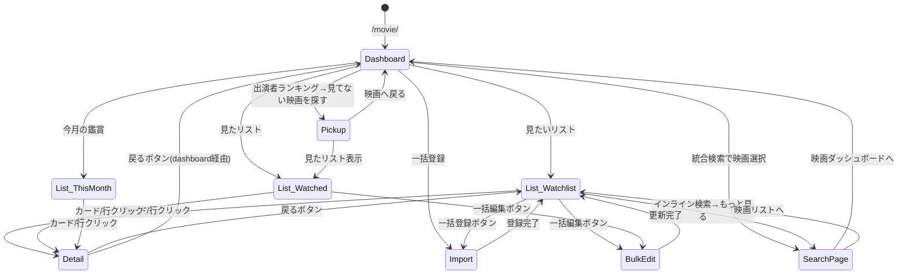
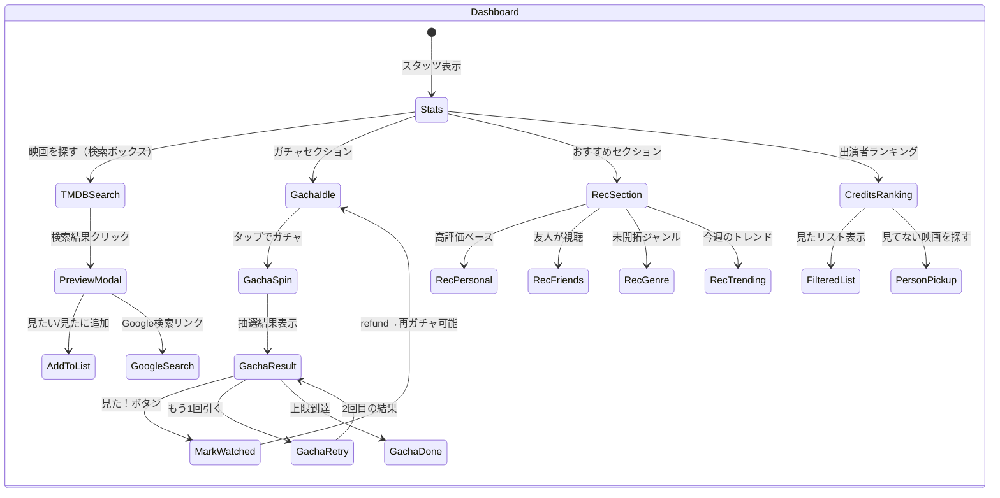
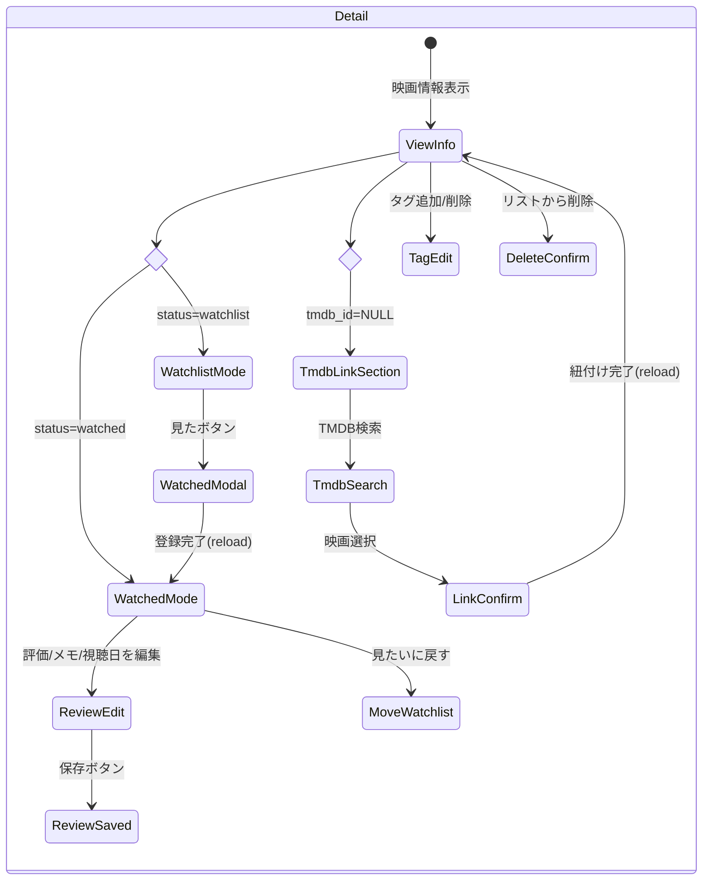

# 映画（Movie） 画面遷移図

## 1. 画面遷移フロー

```mermaid
stateDiagram-v2
    [*] --> Dashboard : /movie/

    Dashboard --> List_Watchlist : 見たいリスト
    Dashboard --> List_Watched : 見たリスト
    Dashboard --> List_ThisMonth : 今月の鑑賞
    Dashboard --> Import : 一括登録
    Dashboard --> SearchPage : 統合検索で映画選択
    Dashboard --> Pickup : 出演者ランキング→見てない映画を探す

    List_Watchlist --> Detail : カード/行クリック
    List_Watched --> Detail : カード/行クリック
    List_ThisMonth --> Detail : カード/行クリック
    List_Watchlist --> Import : 一括登録ボタン
    List_Watchlist --> BulkEdit : 一括編集ボタン
    List_Watched --> BulkEdit : 一括編集ボタン
    List_Watchlist --> SearchPage : インライン検索→もっと見る

    Detail --> List_Watchlist : 戻るボタン
    Detail --> Dashboard : 戻るボタン(dashboard経由)

    Import --> List_Watchlist : 登録完了
    BulkEdit --> List_Watchlist : 更新完了

    SearchPage --> Dashboard : 映画ダッシュボードへ
    SearchPage --> List_Watchlist : 映画リストへ

    Pickup --> List_Watched : 見たリスト表示
    Pickup --> Dashboard : 映画へ戻る
```

## 2. ダッシュボード内のインタラクションフロー

```mermaid
stateDiagram-v2
    state Dashboard {
        [*] --> Stats : スタッツ表示
        Stats --> TMDBSearch : 映画を探す（検索ボックス）
        TMDBSearch --> PreviewModal : 検索結果クリック
        PreviewModal --> AddToList : 見たい/見たに追加
        PreviewModal --> GoogleSearch : Google検索リンク

        Stats --> GachaIdle : ガチャセクション
        GachaIdle --> GachaSpin : タップでガチャ
        GachaSpin --> GachaResult : 抽選結果表示
        GachaResult --> MarkWatched : 見た！ボタン
        MarkWatched --> GachaIdle : refund→再ガチャ可能
        GachaResult --> GachaRetry : もう1回引く
        GachaRetry --> GachaResult : 2回目の結果
        GachaResult --> GachaDone : 上限到達

        Stats --> RecSection : おすすめセクション
        RecSection --> RecPersonal : 高評価ベース
        RecSection --> RecFriends : 友人が視聴
        RecSection --> RecGenre : 未開拓ジャンル
        RecSection --> RecTrending : 今週のトレンド

        Stats --> CreditsRanking : 出演者ランキング
        CreditsRanking --> FilteredList : 見たリスト表示
        CreditsRanking --> PersonPickup : 見てない映画を探す
    }
```

## 3. 映画詳細画面のインタラクション

```mermaid
stateDiagram-v2
    state Detail {
        [*] --> ViewInfo : 映画情報表示

        state if_watchlist <<choice>>
        ViewInfo --> if_watchlist
        if_watchlist --> WatchlistMode : status=watchlist
        if_watchlist --> WatchedMode : status=watched

        WatchlistMode --> WatchedModal : 見たボタン
        WatchedModal --> WatchedMode : 登録完了(reload)

        WatchedMode --> ReviewEdit : 評価/メモ/視聴日を編集
        ReviewEdit --> ReviewSaved : 保存ボタン
        WatchedMode --> MoveWatchlist : 見たいに戻す

        state if_placeholder <<choice>>
        ViewInfo --> if_placeholder
        if_placeholder --> TmdbLinkSection : tmdb_id=NULL
        TmdbLinkSection --> TmdbSearch : TMDB検索
        TmdbSearch --> LinkConfirm : 映画選択
        LinkConfirm --> ViewInfo : 紐付け完了(reload)

        ViewInfo --> TagEdit : タグ追加/削除
        ViewInfo --> DeleteConfirm : リストから削除
    }
```
