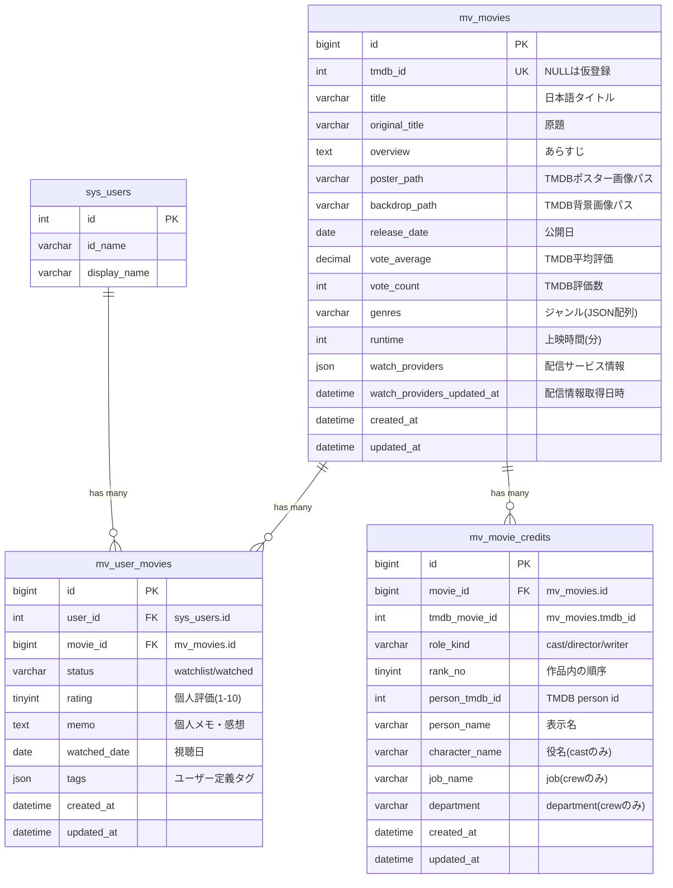

# 映画（Movie） ER図

## 1. データモデル関係図

## 2. テーブル間の関係説明

| 関係 | 説明 |
| :--- | :--- |
| `sys_users` → `mv_user_movies` | 1ユーザーが複数の映画をリストに持てる（1:N）。`user_id` + `movie_id` でユニーク制約 |
| `mv_movies` → `mv_user_movies` | 1つの映画キャッシュに対して複数ユーザーがエントリを持てる（1:N）。ON DELETE CASCADE |
| `mv_movies` → `mv_movie_credits` | 1つの映画に対して複数の出演者情報を持つ（1:N）。ON DELETE CASCADE |

## 3. インデックス構成

| テーブル | インデックス名 | カラム | 種類 |
| :--- | :--- | :--- | :--- |
| `mv_movies` | `PRIMARY` | `id` | PK |
| `mv_movies` | `uq_tmdb_id` | `tmdb_id` | UNIQUE (NULL許容) |
| `mv_user_movies` | `PRIMARY` | `id` | PK |
| `mv_user_movies` | `uq_user_movie` | `user_id, movie_id` | UNIQUE |
| `mv_user_movies` | `idx_user_status` | `user_id, status` | INDEX |
| `mv_movie_credits` | `PRIMARY` | `id` | PK |
| `mv_movie_credits` | `uq_mv_movie_credits_movie_role_person` | `movie_id, role_kind, person_tmdb_id` | UNIQUE |
| `mv_movie_credits` | `idx_mv_movie_credits_movie_role_rank` | `movie_id, role_kind, rank_no` | INDEX |
| `mv_movie_credits` | `idx_mv_movie_credits_person` | `person_tmdb_id` | INDEX |
| `mv_movie_credits` | `idx_mv_movie_credits_role` | `role_kind` | INDEX |
