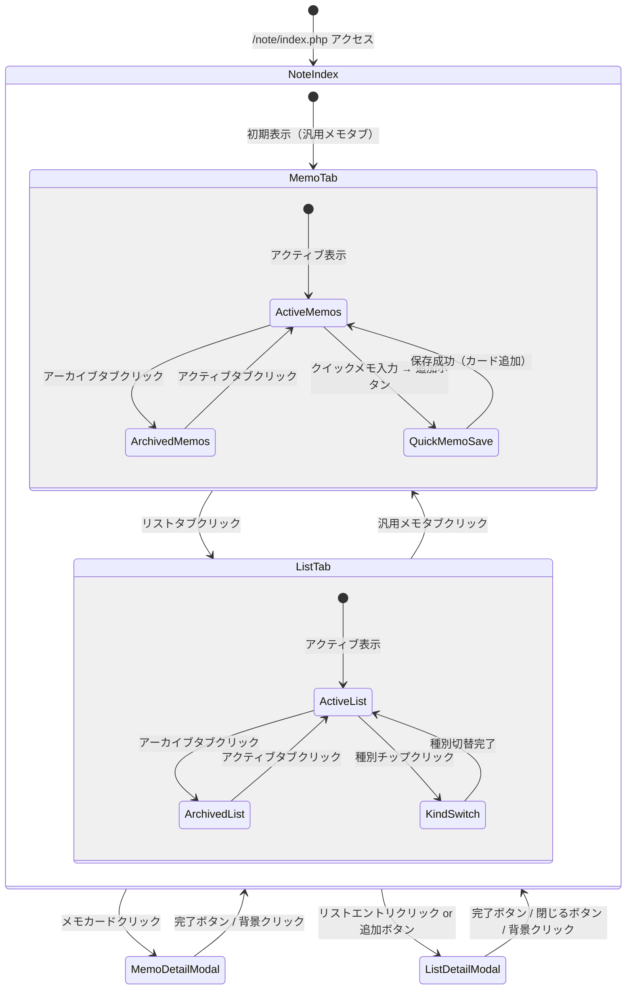

# メモ（Note） 画面遷移図

## 1. 画面遷移フロー



## 2. API呼び出しフロー

```mermaid
flowchart LR
    subgraph 画面操作
        A[クイックメモ追加] --> B[/note/api/save.php]
        C[メモ編集完了] --> D[/note/api/update.php]
        E[メモ削除] --> F[/note/api/delete.php]
        G[ピン留めトグル] --> H[/note/api/toggle_pin.php]
        I[背景色変更] --> D
        J[アーカイブ/復元] --> D
    end

    subgraph リスト操作
        K[リスト新規追加] --> L[/note/api/list_save.php]
        M[リスト編集完了] --> N[/note/api/list_update.php]
        O[リスト削除] --> P[/note/api/list_delete.php]
        Q[リストピン留め] --> R[/note/api/list_toggle_pin.php]
        S[リストアーカイブ/復元] --> N
        T[リスト背景色変更] --> N
    end
```

## 3. URLパラメータによる直接遷移

| URL | 遷移先 |
| :--- | :--- |
| `/note/` | メモ管理画面（汎用メモタブ・アクティブ表示） |
| `/note/?tab=list` | メモ管理画面（リストタブ・デフォルト種別: todo） |
| `/note/?tab=list&kind=todo` | メモ管理画面（リストタブ・やること種別） |
| `/note/?tab=list&kind=question` | メモ管理画面（リストタブ・疑問・仮説種別） |
| `/note/?tab=list&kind=first_time` | メモ管理画面（リストタブ・はじめて種別） |
| `/note/?tab=list&kind=fun` | メモ管理画面（リストタブ・おもろかったこと種別） |
| `/note/?tab=list&kind=book` | メモ管理画面（リストタブ・書籍メモ種別） |
| `/note/?tab=list&kind=generic_list` | メモ管理画面（リストタブ・汎用リスト種別） |
