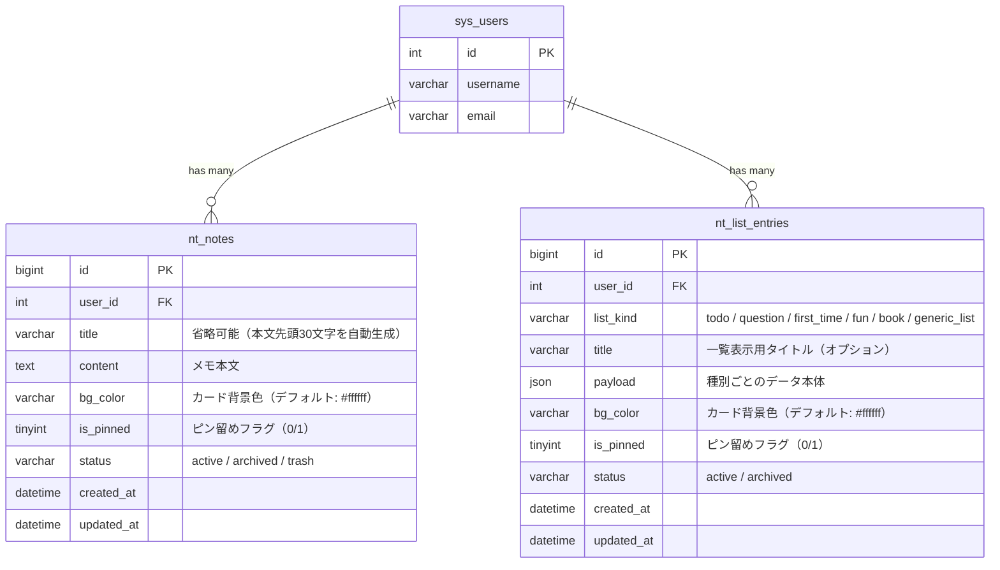

# メモ（Note） ER図

## 1. データモデル関係図

## 2. テーブル間の関連

- `nt_notes` と `nt_list_entries` は直接の外部キー関連を持たず、独立したテーブルとして運用される。
- 両テーブルとも `user_id` により `sys_users` と紐づき、`BaseModel::$isUserIsolated = true` によってユーザー単位でデータが隔離される。

## 3. インデックス

### nt_notes
| インデックス名 | カラム | 用途 |
| :--- | :--- | :--- |
| PRIMARY | `id` | 主キー |
| `idx_user_status` | `user_id`, `status` | ユーザー別・ステータス別のメモ取得に使用 |

### nt_list_entries
| インデックス名 | カラム | 用途 |
| :--- | :--- | :--- |
| PRIMARY | `id` | 主キー |
| `idx_user_kind_status` | `user_id`, `list_kind`, `status` | ユーザー別・種別別・ステータス別のリスト取得に使用 |
| `idx_user_status` | `user_id`, `status` | ユーザー別・ステータス別の横断取得に使用 |
