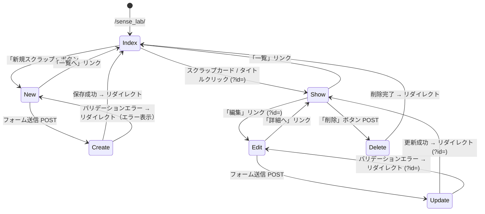
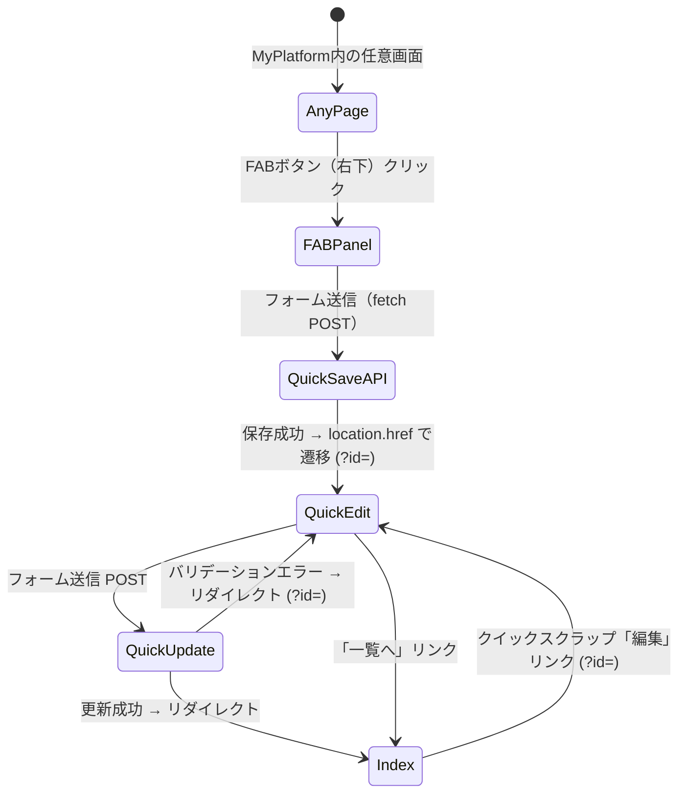
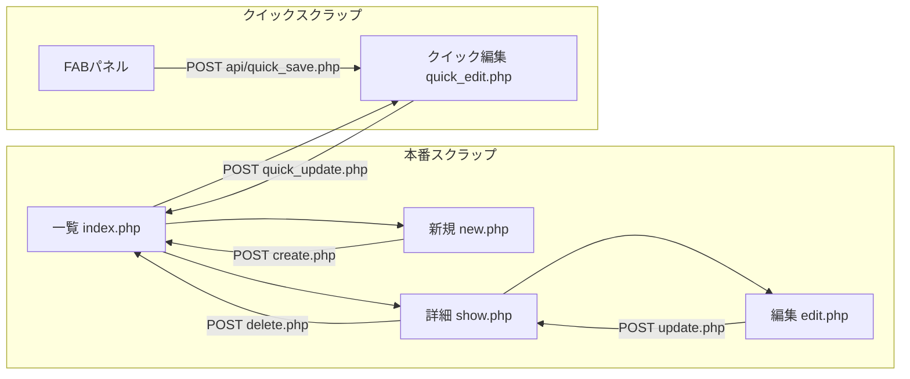

# Sense Lab（センスラボ） 画面遷移図

## 1. 画面遷移フロー（本番スクラップ）

```mermaid
stateDiagram-v2
    [*] --> Index : /sense_lab/
    Index --> New : 「新規スクラップ」ボタン
    New --> Create : フォーム送信 POST
    Create --> Index : 保存成功 → リダイレクト
    Create --> New : バリデーションエラー → リダイレクト（エラー表示）

    Index --> Show : スクラップカード / タイトルクリック (?id=)
    Show --> Edit : 「編集」リンク (?id=)
    Show --> Delete : 「削除」ボタン POST
    Delete --> Index : 削除完了 → リダイレクト

    Edit --> Update : フォーム送信 POST
    Update --> Show : 更新成功 → リダイレクト (?id=)
    Update --> Edit : バリデーションエラー → リダイレクト (?id=)

    Show --> Index : 「一覧」リンク
    Edit --> Show : 「詳細へ」リンク
    New --> Index : 「一覧へ」リンク
```

## 2. 画面遷移フロー（クイックスクラップ）

```mermaid
stateDiagram-v2
    [*] --> AnyPage : MyPlatform内の任意画面
    AnyPage --> FABPanel : FABボタン（右下）クリック
    FABPanel --> QuickSaveAPI : フォーム送信（fetch POST）
    QuickSaveAPI --> QuickEdit : 保存成功 → location.href で遷移 (?id=)

    Index --> QuickEdit : クイックスクラップ「編集」リンク (?id=)
    QuickEdit --> QuickUpdate : フォーム送信 POST
    QuickUpdate --> Index : 更新成功 → リダイレクト
    QuickUpdate --> QuickEdit : バリデーションエラー → リダイレクト (?id=)
    QuickEdit --> Index : 「一覧へ」リンク
```

## 3. 画面遷移概要（統合）

```mermaid
flowchart LR
    subgraph 本番スクラップ
        A[一覧 index.php] --> B[新規 new.php]
        B -->|POST create.php| A
        A --> C[詳細 show.php]
        C --> D[編集 edit.php]
        D -->|POST update.php| C
        C -->|POST delete.php| A
    end

    subgraph クイックスクラップ
        E[FABパネル] -->|POST api/quick_save.php| F[クイック編集 quick_edit.php]
        F -->|POST quick_update.php| A
        A --> F
    end
```
