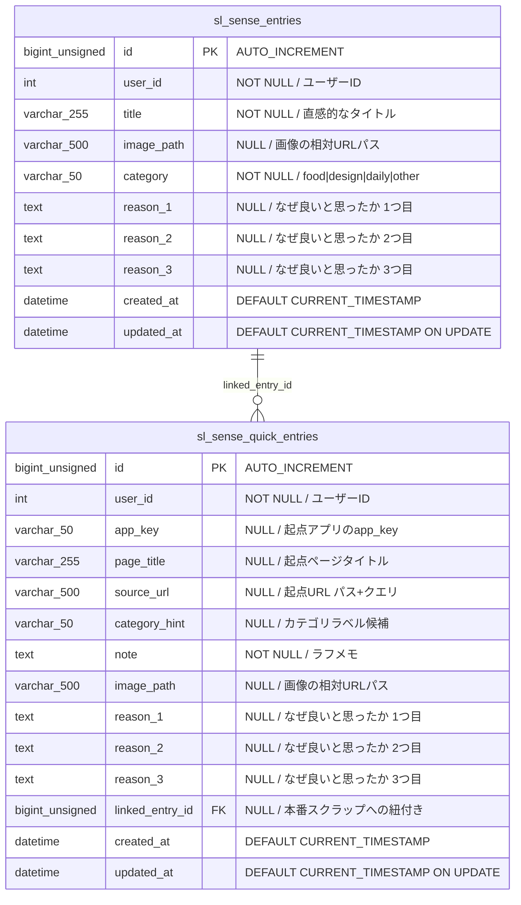

# Sense Lab（センスラボ） ER図

## 1. データモデル関係図

## 2. インデックス定義

### sl_sense_entries
| インデックス名 | カラム | 用途 |
| :--- | :--- | :--- |
| PRIMARY | `id` | 主キー |
| `idx_user` | `user_id` | ユーザー別の一覧取得 |
| `idx_category` | `category` | カテゴリ別フィルタ・集計 |
| `idx_created_at` | `created_at` | 作成日順ソート |

### sl_sense_quick_entries
| インデックス名 | カラム | 用途 |
| :--- | :--- | :--- |
| PRIMARY | `id` | 主キー |
| `idx_user_created` | `user_id, created_at` | ユーザー別・日時順の一覧取得 |
| `idx_app` | `app_key` | 起点アプリ別の絞り込み |
| `idx_linked` | `linked_entry_id` | 本番スクラップとの紐付き検索 |

## 3. マイグレーション履歴
| ファイル名 | 概要 |
| :--- | :--- |
| `create_sl_sense_lab.sql` | `sl_sense_entries` と `sl_sense_quick_entries` の初期作成、`sys_apps` への登録 |
| `alter_sl_sense_entries_image_path_nullable.sql` | `sl_sense_entries.image_path` を NULL許可に変更 |
| `fix_sl_sense_entries_image_path_to_uploads.sql` | 画像パスを `/upload/` から `/uploads/` に統一 |
| `add_sl_sense_quick_entries_image_path.sql` | `sl_sense_quick_entries` に `image_path` カラムを追加 |
| `add_sl_sense_quick_entries_reasons.sql` | `sl_sense_quick_entries` に `reason_1` 〜 `reason_3` カラムを追加 |
