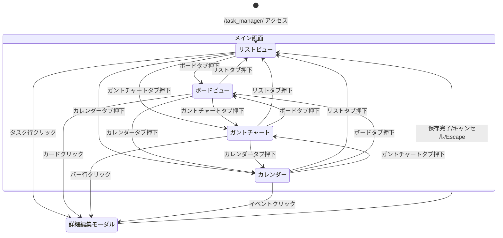
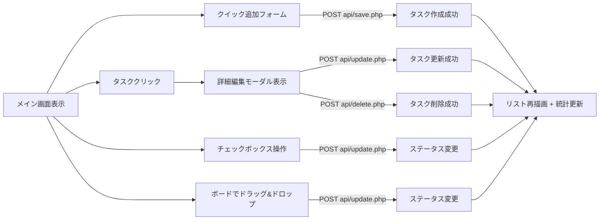

# タスク管理 画面遷移図

## 1. 画面遷移フロー

タスク管理は単一画面（SPA的構成）で完結する。画面内のモード切替（タブ）とモーダルにより操作が行われる。

## 2. 操作フロー詳細

## 3. URL パラメータ遷移

| パラメータ | 動作 |
| :--- | :--- |
| `/task_manager/` | 通常のリストビュー表示 |
| `/task_manager/?task_id=N` | 初期表示後に該当タスクの詳細モーダルを自動オープン。オープン後URLを `/task_manager/` にリプレース |
