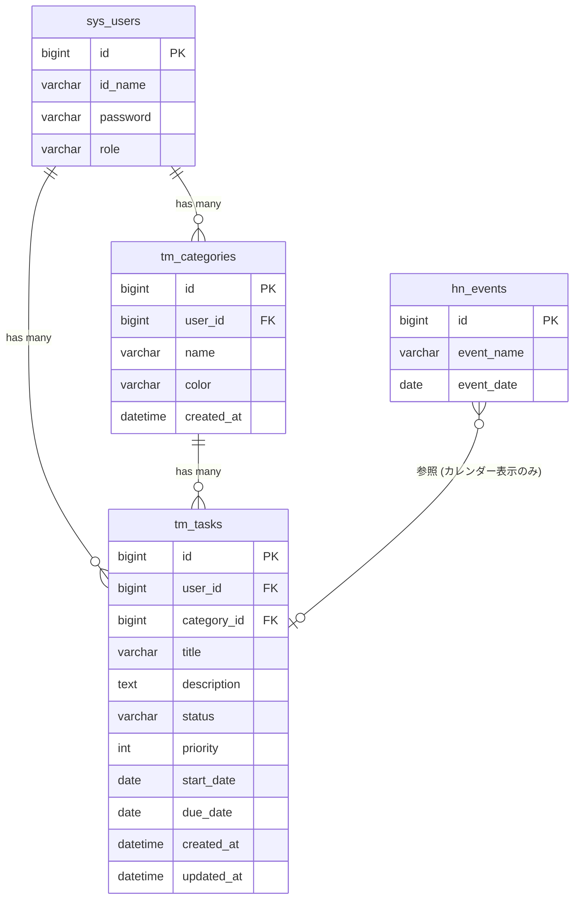

# タスク管理 ER図

## 1. データモデル関係図

## 2. テーブル間リレーション説明

| 親テーブル | 子テーブル | 関係 | 説明 |
| :--- | :--- | :--- | :--- |
| sys_users | tm_tasks | 1:N | 1ユーザーが複数のタスクを持つ。BaseModelの `isUserIsolated=true` により user_id で自動隔離 |
| sys_users | tm_categories | 1:N | 1ユーザーが複数のカテゴリを持つ。ユーザーごとに独立したカテゴリ体系 |
| tm_categories | tm_tasks | 1:N | 1カテゴリに複数のタスクが紐付く。category_id は NULL 許容（未分類） |
| hn_events | (参照のみ) | - | カレンダービューで日向坂イベントを重畳表示するために参照。tm_tasks との直接的なFK関係はない |
