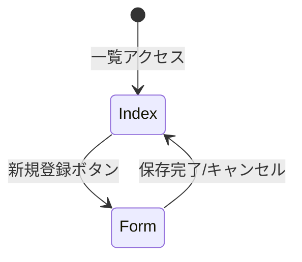

<!--
新規機能設計書を生成するときの AI 指示:
- stateDiagram-v2 または flowchart LR を機能に適したものに変更可。ユーザーの起点（ログイン後トップなど）を明記。
- 主要 GET パラメータ（例 ?id=）が遷移に効く場合、エッジのラベルに含める。
- フェンス終了 ``` は必ず閉じる。
-->
# [機能名] 画面遷移図

## 1. 画面遷移フロー
