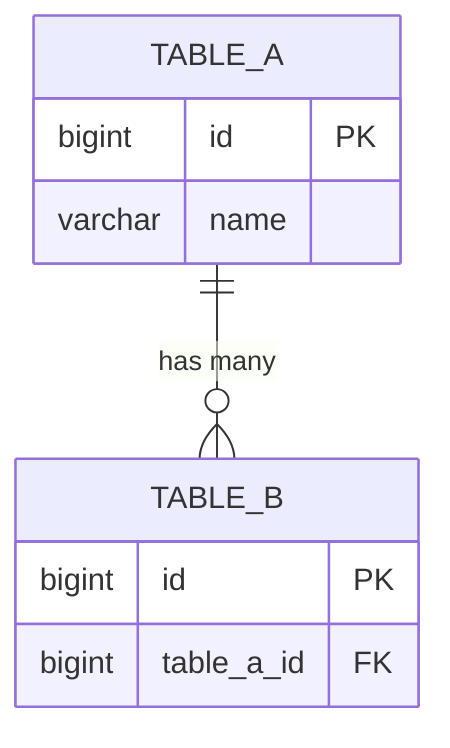

<!--
新規機能設計書を生成するときの AI 指示:
- migrations と Model の $table/$fields を突き合わせ、現在の実装に合わせたエンティティ名を使う。
- システム横断テーブル（sys_* / hn_* を参照のみする場合）は関係線で「参照」とラベル。
- ER図には主要カラム型と PK/FK を Mermaid の entity 構文で書く。
-->
# [機能名] ER図

## 1. データモデル関係図
