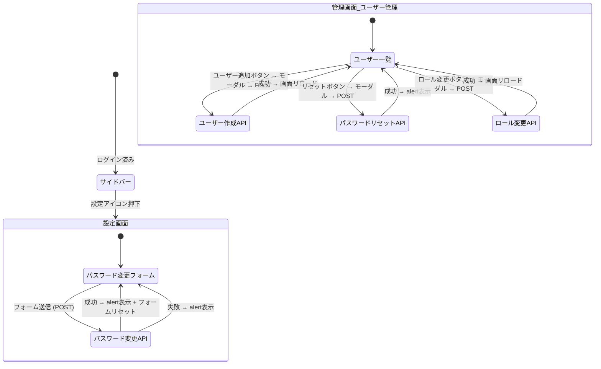

# ユーザー設定（users_settings） 画面遷移図

## 1. 画面遷移フロー

本機能は単一画面（パスワード変更フォーム）とAPIエンドポイント群で構成される。画面遷移は最小限であり、主にサイドバーからのアクセスとAPI呼び出しが中心となる。

## 2. 導線の補足
- **設定画面への導線**: 共通サイドバー（`private/components/sidebar.php`）のフッター部にある歯車アイコンから `/users_settings/` へ遷移する。全画面共通で表示される。
- **管理者向けAPI**: 管理画面（`/admin/users.php`）のUIから `/users_settings/api/` 配下のAPIを呼び出す構成。管理画面自体は別アプリ（Admin）の画面であり、本機能は API のみを提供する。
- **未ログイン時**: `Auth::requireLogin()` により `/login.php` へリダイレクトされる。
