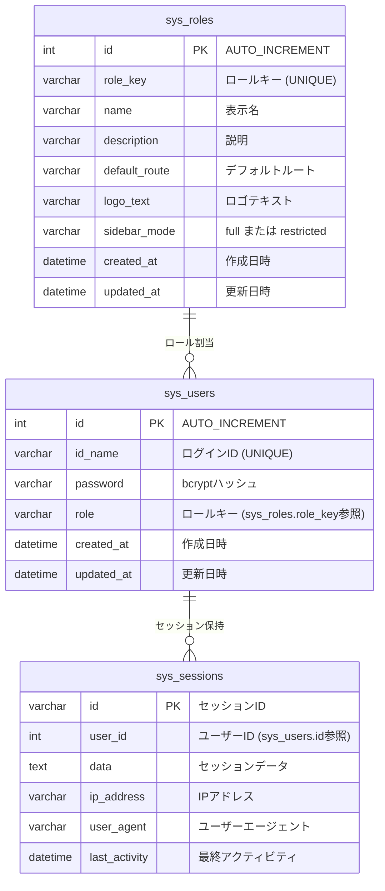

# ユーザー設定（users_settings） ER図

## 1. データモデル関係図

本機能はユーザー設定専用のテーブルを持たず、システム共通テーブル（`sys_users`、`sys_roles`、`sys_sessions`）を操作する。

## 2. 補足
- `sys_users.role` は `sys_roles.role_key` を文字列で格納する設計（外部キー制約ではなくアプリケーション層で整合性を担保）。
- `sys_sessions` はPHPのカスタムセッションハンドラ（`Core\SessionManager`）が管理する。`user_id` カラムにより特定ユーザーのセッション一括無効化が可能。
- `sys_users` と `sys_roles` の関係は `role` カラム（文字列）を介した論理的な参照であり、RDB上の外部キー制約は設定されていない。
